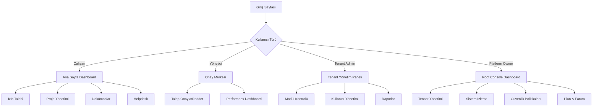

# CoreFly v1 - Enterprise Workspace & Operator Platform

## 1. Ürün Genel Bakış

CoreFly v1, kurumsal intranet ve iş yönetimi için tasarlanmış maksimum kapsamlı, multi-tenant, AI'sız ve tamamen kural tabanlı bir Enterprise Workspace & Operator Platformudur. 57 modülden oluşan kesin sınır koyan bir ürün kapsamına sahiptir.

Platform, çalışanların günlük iş süreçlerini tek bir çatı altından yönetmelerini sağlarken, yöneticilere kapsamlı raporlama ve kontrol imkanları sunar. Multi-tenant mimarisi sayesinde birden fazla kurumun verilerini tamamen izole şekilde yönetebilir.

## 2. Temel Özellikler

### 2.1 Kullanıcı Rolleri

| Rol | Kayıt Yöntemi | Temel Yetkiler | Detaylı Açıklama |
|-----|---------------|----------------|------------------|
| Çalışan | Tenant admin tarafından davet | Temel modülleri kullanma, profil yönetimi | İzin talebi oluşturabilir, görevlerini yönetebilir, dokümanlara erişebilir |
| Departman Yöneticisi | Tenant admin tarafından atama | Takım üyelerini yönetme, onay süreçleri | Takımının izin ve harcama taleplerini onaylayabilir, performans değerlendirmesi yapabilir |
| Tenant Admin | Root console üzerinden oluşturulma | Tenant içi tüm modülleri yönetme, kullanıcı yönetimi | Modül açma/kapama, kullanıcı davetleri, tenant ayarları ve raporlamalar |
| Platform Owner | Root console üzerinden oluşturulma | Tüm tenant'ları yönetme, sistem konfigürasyonu | Tenant oluşturma, sistem ayarları, global politikalar, fatura ve ödemeler |

### 2.2 Multi-Tenant Mimarisi

**Row-level Isolation Stratejisi**: Her tabloda `tenant_id` kolonu bulunur, tüm veri erişimleri bu alan üzerinden filtrelenir.

**Tenant Detection**: 
- Subdomain bazlı: `{tenant}.corefly.com`
- Header bazlı: `X-Tenant-Subdomain`
- JWT token içinde tenant bilgisi

**Tenant İzolasyon Kuralları**:
- Kullanıcılar sadece kendi tenant'larında veri görebilir
- Yöneticiler sadece kendi tenant'larındaki kullanıcıları yönetebilir
- Root kullanıcılar tüm tenant'lara erişebilir
- Tenant'lar arası veri paylaşımı yasaktır

### 2.3 Modül Sınırları ve Kapsamları

**İzin Yönetimi Modülü**:
- Maksimum yıllık izin günü: 30 gün (konfigüre edilebilir)
- Aynı anda maksimum 2 bekleyen izin talebi
- Minimum 24 saat önceden izin talebi zorunluluğu
- Departman yöneticisi yoksa, bir üst yöneticiye yönlendirme
- Tarih çakışması durumunda otomatik red
- İzin bakiyesi yetersizse talep oluşturulamaz

**Mesajlaşma Modülü**:
- Maksimum dosya boyutu: 25MB
- Grup sohbeti maksimum üye: 100 kişi
- Mesaj geçmişi: 90 gün (konfigüre edilebilir)
- Real-time bildirim: WebSocket üzerinden
- Okundu bilgisi: Evet, kullanıcı başına
- Yazıyor... göstergesi: 3 saniye gecikmeli

**Doküman Yönetimi**:
- Maksimum dosya boyutu: 100MB
- Desteklenen formatlar: PDF, DOC, DOCX, XLS, XLSX, PPT, PPTX, JPG, PNG, ZIP
- Sürüm kontrolü: Maksimum 10 versiyon
- Depolama kotası: Tenant başına 10GB (plan'a göre değişebilir)
- Erişim kontrolü: Kullanıcı ve departman bazlı

### 2.2 Özellik Modülleri

**Tenant Tarafı (35 Modül)**

1. **Ana Sayfa / Feed**: Kişisel dashboard, duyurular, görevler, bildirimler
2. **Haber & Duyuru Merkezi**: Kurumsal duyurular, duyuru yönetimi
3. **Mesajlaşma & Yorumlar**: İç iletişim, yorum sistemleri
4. **Bildirim Merkezi**: Tüm sistem bildirimleri, bildirim tercihleri
5. **Çalışan Dizini & Profilleri**: Çalışan arama, profil görüntüleme
6. **İzin Yönetimi**: İzin talepleri, onay süreçleri, bakiye takibi
7. **Vardiya & Devamlılık**: Vardiya planlama, devamsızlık takibi
8. **Masraf & Harcama Talepleri**: Masraf bildirimi, onay süreci, ödeme takibi
9. **Onboarding / Offboarding**: Yeni çalışan süreçleri, ayrılış süreçleri
10. **Performans & Hedef Yönetimi (OKR)**: Hedef belirleme, performans değerlendirme
11. **Proje Yönetimi**: Proje oluşturma, takip, raporlama
12. **Görev Yönetimi (Kanban)**: Görev kartları, board yönetimi
13. **İş Akışları / Onay Süreçleri**: Özelleştirilebilir onay akışları
14. **Zaman Takibi / Timesheet**: Çalışan zaman girişi, proje bazlı takip
15. **Doküman Yönetimi (DMS)**: Dosya yükleme, sürüm kontrolü, paylaşım
16. **Bilgi Bankası (Knowledge Base)**: Wiki tarzı bilgi deposu
17. **Eğitim Yönetimi / LMS Light**: Eğitim içerikleri, katılım takibi
18. **Politika / Prosedür Yönetimi**: Şirket politikaları, doküman yönetimi
19. **Helpdesk / Ticketing**: Destek talepleri, SLA takibi
20. **Incident Management**: Olay yönetimi, çözüm süreçleri
21. **IT Envanter & Varlık Yönetimi**: Donanım yazılım envanteri
22. **Satınalma Talep Yönetimi**: Satınalma talepleri, onay süreçleri
23. **Vendor / Tedarikçi Yönetimi**: Tedarikçi bilgileri, performans takibi
24. **Ödeme & Avans Talepleri**: Avans talepleri, ödeme süreçleri
25. **Anket / Pulse Check**: Çalışan memnuniyet anketleri
26. **Ödül & Takdir (Kudos)**: Çalışan takdir sistemi
27. **İç Kariyer / Job Board**: İç iş ilanları, başvuru süreçleri
28. **Internal Store / Market**: Şirket içi eşya satışı
29. **Ofis Bilgileri & Oturma Planı**: Ofis haritaları, çalışan yerleşimi
30. **Servis & Ulaşım**: Servis güzergahları, ulaşım bilgileri
31. **Yemek / Menü Yönetimi**: Günlük menü, yemek tercihleri
32. **Şirket Link Dizini**: Sık kullanılan linkler, kategorilendirme
33. **Kişisel Yer İmleri / Favoriler**: Kişisel kısayollar
34. **Standart Raporlar**: Önceden tanımlı raporlar
35. **Yönetici KPI Panelleri**: Kural tabanlı KPI hesaplamaları

**Root Console (22 Modül)**

36. **Tenant CRUD & Plan Yönetimi**: Tenant oluşturma, düzenleme, plan atama
37. **Tenant Sağlık Durumu & Usage Metrics**: Tenant performans takibi
38. **Tenant Bazlı Modül Yönetimi**: Modül açma/kapama
39. **Tüm Kullanıcı Havuzu Yönetimi**: Global kullanıcı arama, yönetim
40. **Parola/MFA/Suspension Yönetimi**: Güvenlik kontrolleri
41. **Login & Security Audit**: Giriş denemeleri, güvenlik logları
42. **Canlı Log Stream (Terminal)**: Gerçek zamanlı sistem logları
43. **System Metrics Dashboard**: CPU, RAM, Disk kullanımı
44. **Global API Analytics**: API kullanım istatistikleri
45. **Tenant Freeze/Unfreeze**: Tenant durum yönetimi
46. **Maintenance Mode**: Bakım modu kontrolü
47. **Cache Yönetimi**: Sistem önbelleği yönetimi
48. **Impersonation**: Kullanıcı hesabına giriş
49. **Feature Flags Yönetimi**: Özellik anahtarları
50. **Global Duyurular / Banner Yönetimi**: Platform geneli duyurular
51. **Sürüm Notları / Changelog**: Versiyon bilgilendirme
52. **Plan Tanımlama**: Abonelik planları, özellik setleri
53. **Kullanım Bazlı Metering**: Kullanım ölçümü, kotalar
54. **Fatura & Ödeme Geçmişi**: Finansal takip, ödeme geçmişi
55. **Audit Log Yönetimi**: Tüm sistem işlemlerinin logu
56. **IP Restriction / Access Policies**: IP tabanlı erişim kontrolü
57. **Root Kullanıcı Yönetimi**: Platform sahibi hesapları

### 2.3 Kullanıcı Hikâyeleri ve Kabul Kriterleri

#### 2.3.1 İzin Yönetimi Modülü

**Kullanıcı Hikâyesi 1**: Bir çalışan olarak, izin talebi oluşturabilmek istiyorum.

**Kabul Kriterleri**:
- ✅ Kullanıcı izin türü seçebilmeli (yıllık, hastalık, mazeret)
- ✅ Başlangıç ve bitiş tarihi seçilebilmeli
- ✅ Minimum 24 saat önceden talep oluşturulabilmeli
- ✅ Aynı tarihlerde başka onaylı izin varsa, sistem uyarı vermeli
- ✅ İzin bakiyesi yetersizse talep oluşturulamamalı
- ✅ Açıklama alanı zorunlu olmalı (minimum 10 karakter)
- ✅ Talep oluşturulduğunda yöneticiye bildirim gitmeli

**Edge Case Senaryoları**:
- Departman yöneticisi yoksa → Bir üst yöneticiye yönlendirme
- Aynı anda 2'den fazla bekleyen talep varsa → Yeni talep oluşturulamaz
- Tarih geçmişse → Hata mesajı göster
- Sistem bakım modundaysa → Özel bakım sayfası göster

**Kullanıcı Hikâyesi 2**: Bir yönetici olarak, izin taleplerini onaylayabilmek veya reddedebilmek istiyorum.

**Kabul Kriterleri**:
- ✅ Sadece kendi takımımın taleplerini görebilmeliyim
- ✅ Talep detaylarını inceleyebilmeliyim
- ✅ Onay/red sebebi girebilmeliyim
- ✅ Reddedilen talep tekrar düzenlenebilmeli
- ✅ Onaylanan talep sistem tarafından işleme alınmalı
- ✅ Karar verildiğinde kullanıcıya bildirim gitmeli

#### 2.3.2 Mesajlaşma Modülü

**Kullanıcı Hikâyesi 3**: Bir çalışan olarak, gerçek zamanlı mesajlaşabilmek istiyorum.

**Kabul Kriterleri**:
- ✅ Mesajlar 3 saniye içinde iletilmeli
- ✅ Dosya ekleme desteği olmalı (max 25MB)
- ✅ Grup mesajlaşması desteklenmeli (max 100 kişi)
- ✅ Okundu bilgisi gösterilmeli
- ✅ Yazıyor... göstergesi 3 saniye gecikmeli
- ✅ Çevrimdışı kullanıcılar için mesaj kuyruğu oluşturulmalı
- ✅ Mesaj geçmişi 90 gün saklanmalı

**Edge Case Senaryoları**:
- Alıcı aktif değilse → Mesaj kuyruğa alınır
- Dosya boyutu aşılırsa → Parçalı yükleme önerisi
- Grup limiti aşılırsa → Hata mesajı
- Network bağlantısı koparsa → Yerel kuyruk kullanılır

#### 2.3.3 Doküman Yönetimi Modülü

**Kullanıcı Hikâyesi 4**: Bir çalışan olarak, doküman yükleyebilmek ve sürüm kontrolü yapabilmek istiyorum.

**Kabul Kriterleri**:
- ✅ Dosya boyutu max 100MB olmalı
- ✅ Desteklenen formatlar: PDF, DOC, DOCX, XLS, XLSX, PPT, PPTX, JPG, PNG, ZIP
- ✅ Sürüm kontrolü desteklenmeli (max 10 versiyon)
- ✅ Erişim kontrolü kullanıcı ve departman bazlı olmalı
- ✅ Dosya önizlemesi tarayıcıda yapılabilmeli
- ✅ İndirme ve yükleme logları tutulmalı
- ✅ Depolama kotası aşıldığında uyarı verilmeli

### 2.4 Sayfa Detayları ve İş Kuralları

| Sayfa Adı | Modül Adı | Özellik Açıklaması | İş Kuralları |
|-----------|------------|---------------------|---------------|
| Ana Sayfa | Kişisel Dashboard | Tüm modüllerden gelen özet bilgileri göster, widget bazlı düzenleme yap | - Widget'lar kullanıcıya özel kaydedilir - 4x4 grid düzeni - Responsive tasarım |
| Ana Sayfa | Bildirim Merkezi | Okunmamış bildirimleri listele, bildirim türlerine göre filtrele | - 30 gün geçmiş - Okundu/okunmadı durumu - Push bildirim desteği |
| İzin Talebi | Yeni Talep Formu | İzin türü, tarih aralığı, açıklama alanları ile form oluştur | - Minimum 24 saat önceden - Tarih çakışması kontrolü - Bakiye yeterlilik kontrolü |
| İzin Talebi | Talep Listesi | Geçmiş ve bekleyen izin taleplerini göster | - Kronolojik sıralama - Durum filtresi - Detay görünümü |
| Proje Yönetimi | Proje Listesi | Aktif projeleri kart görünümünde sun, ilerleme durumu göster | - Görev tamamlanma oranı - Takım üye sayısı - Son güncelleme tarihi |
| Mesajlaşma | Sohbet Penceresi | Gerçek zamanlı mesajlaşma, dosya paylaşımı yap | - WebSocket bağlantısı - 25MB dosya limiti - Okundu bilgisi |
| Dokümanlar | Klasör Görünümü | Hiyerarşik dosya düzeni, sürüm geçmişi sun | - 10 versiyon limiti - Erişim kontrolü - Önizleme desteği |
| Helpdesk | Talep Formu | Konu, kategori, öncelik, açıklama alanları ile destek talebi oluştur | - SLA hesaplaması - Otomatik atama - Dosya ekleyebilme |
| Raporlar | KPI Dashboard | Grafiksel KPI gösterimi, tarih aralığı seçimi yap | - Gerçek zamanlı veri - PDF/Excel export - Grafik interaktifliği |
| Tenant Yönetim | Modül Kontrolü | Aktif/pasif modül durumlarını göster, değiştir | - Anlık geçerli olur - Kullanıcı etkilenme listesi - Geri alma desteği |
| Root Console | Sistem Durumu | Tüm tenant'ların sağlık durumunu özetle göster | - CPU, RAM, Disk kullanımı - Aktif kullanıcı sayısı - API response zamanları |

## 3. Temel Süreçler ve İş Akışları

### 3.1 Çalışan Akışı

**Ana Süreç**: Ana sayfaya giriş yapan çalışan, kişisel dashboard üzerinden duyuruları, görevlerini ve bildirimlerini görür. Üst menüden istediği modüle geçiş yapabilir. İzin talebi oluşturmak için İzin Yönetimi modülüne gider, formu doldurur ve yöneticisine gönderir. Talebi anlık olarak takip edebilir.

**Detaylı Adımlar**:
1. **Giriş**: Email ve şifre ile authentication
2. **Dashboard**: Kişisel widget'lar ve kısayollar
3. **İzin Talebi**: Form doldurma → Tarih kontrolü → Bakiye kontrolü → Gönderim
4. **Takip**: Talep durumu, onay süreci, bildirimler
5. **Bildirim**: Onay/red sonucu push notification

**İş Kuralları**:
- Her kullanıcı sadece kendi tenant'ında veri görebilir
- İzin talepleri minimum 24 saat önceden yapılmalı
- Aynı anda maksimum 2 bekleyen izin talebi olabilir
- Tarih çakışması varsa sistem otomatik red verir

### 3.2 Yönetici Akışı

**Ana Süreç**: Departman yöneticisi, onay merkezi üzerinden tüm bekleyen talepleri görür. Detayını inceleyip onaylayabilir veya reddedebilir. Kararı sistem otomatik olarak ilgili kişiye bildirir. Aynı zamanda takımının performansını KPI dashboard üzerinden izleyebilir.

**Detaylı Adımlar**:
1. **Onay Merkezi**: Tüm bekleyen taleplerin listesi
2. **Detay İnceleme**: Kullanıcı bilgisi, tarihler, gerekçe
3. **Karar**: Onay → Açıklama gerekli; Red → Sebep zorunlu
4. **Bildirim**: Kullanıcıya email ve push notification
5. **Takip**: Onaylanan talebin işleme alınması

**İş Kuralları**:
- Yöneticiler sadece kendi takımlarının taleplerini görebilir
- Onay/red kararı geri alınamaz
- Reddedilen talep tekrar düzenlenebilir
- Onaylanan talep otomatik olarak sistem güncellemeleri yapar

### 3.3 Tenant Admin Akışı

**Ana Süreç**: Tenant admin, yönetim panelinden modül aktif/pasif durumlarını kontrol eder. Yeni çalışan davetleri gönderir, rol atamaları yapar. Tenant bazlı raporları görüntüler ve gerekli konfigürasyonları yapar.

**Detaylı Adımlar**:
1. **Modül Yönetimi**: Aktif/pasif durum kontrolü
2. **Kullanıcı Daveti**: Email ile davet gönderimi
3. **Rol Atama**: Kullanıcıya rol ve yetki tanımlama
4. **Raporlama**: Tenant bazlı analiz ve metrikler
5. **Ayarlar**: Tenant konfigürasyonları

**İş Kuralları**:
- Adminler tenant ayarlarını değiştirebilir
- Modül durumu değişikliği anında geçerlidir
- Kullanıcı davetleri 7 gün geçerlidir
- Raporlar gerçek zamanlı değil, maksimum 5 dakika gecikmelidir

### 3.4 Platform Owner Akışı

**Ana Süreç**: Root console üzerinden tüm tenant'ların durumunu izler. Yeni tenant'lar oluşturur, plan atamaları yapar. Sistem sağlığı ve kullanım metriklerini takip eder. Global duyurular yayınlar ve güvenlik politikalarını yönetir.

**Detaylı Adımlar**:
1. **Tenant CRUD**: Yeni tenant oluşturma, düzenleme, silme
2. **Plan Yönetimi**: Abonelik planı atama ve değiştirme
3. **Sistem İzleme**: CPU, RAM, Disk kullanım takibi
4. **Global Duyuru**: Tüm tenant'lara duyuru yayınlama
5. **Güvenlik**: IP politikaları, impersonation, audit log

**İş Kuralları**:
- Platform owner'lar tüm tenant'lara erişebilir
- Tenant freeze/unfreeze işlemleri loglanır
- Global duyurular tüm aktif kullanıcılara gider
- Sistem bakım modu tüm tenant'ları etkiler

### 3.5 Root Console Özel Akışları

**Tenant Freeze Süreci**:
1. Owner → Tenant seç → Freeze sebebi gir → Onayla
2. Sistem → Tüm kullanıcılara bildirim gönder
3. Tüm aktif session'lar sonlandırılır
4. Tenant login sayfası bakım modu gösterir
5. Freeze süresi dolunca otomatik açılır

**Impersonation Süreci**:
1. Owner → Kullanıcı ara → Impersonate seç
2. Güvenlik onayı (2FA gerekli)
3. Audit log kaydı oluştur
4. Hedef kullanıcı session'ı başlat
5. Session süresi: 30 dakika (otomatik sonlanır)

**Global Duyuru Yayını**:
1. Owner → Duyuru oluştur → Hedef kitle seç
2. Zamanlama ve öncelik belirle
3. Onay ve yayınlama
4. Tüm hedef kullanıcılara push notification
5. Email ve dashboard bildirimi

## 4. Detaylı Yol Haritası ve Sprint Planı

### 4.1 Genel Yol Haritası (12 Ay)

**Sprint 0 - Altyapı ve Temel Sistem (4 Hafta)**
- Multi-tenant veritabanı mimarisi
- Kimlik doğrulama ve yetkilendirme sistemi
- Temel UI framework kurulumu
- CI/CD pipeline kurulumu
- Monitoring ve logging altyapısı

**Sprint 1 - Workspace & Communication Çekirdeği (6 Hafta)**
- Ana dashboard ve widget sistemi
- Kullanıcı profil ve yönetimi
- Temel bildirim sistemi
- Haber & duyuru merkezi
- Temel mesajlaşma (async)

**Sprint 2 - HR Core Modülleri (8 Hafta)**
- İzin yönetimi (temel akış)
- Çalışan dizini ve organizasyon şeması
- Onboarding temel akışı
- Vardiya & devamlılık takibi
- Performans hedefleme (temel)

**Sprint 3 - Proje & Görev Yönetimi (6 Hafta)**
- Proje oluşturma ve yönetim
- Kanban tahtası (temel)
- Görev atama ve takip
- Zaman takibi (timesheet)
- Temel raporlama

**Sprint 4 - Doküman & Bilgi Yönetimi (6 Hafta)**
- Doküman yönetim sistemi (DMS)
- Bilgi bankası (wiki)
- Dosya paylaşım ve sürüm kontrolü
- Arama ve indeksleme

**Sprint 5 - Destek & Operasyon (6 Hafta)**
- Helpdesk/ticketing sistemi
- SLA yönetimi
- Incident management
- IT envanter yönetimi
- Satınalma talepleri

**Sprint 6 - Finansal Modüller (6 Hafta)**
- Masraf ve harcama talepleri
- Avans ve ödeme talepleri
- Fatura yönetimi
- Bütçe takibi

**Sprint 7 - Gelişmiş İletişim (6 Hafta)**
- Gerçek zamanlı mesajlaşma (WebSocket)
- Video konferans entegrasyonu
- Toplantı odası rezervasyonu
- Anket ve feedback sistemleri

**Sprint 8 - Gelişmiş HR (6 Hafta)**
- Eğitim yönetimi (LMS light)
- Kariyer ve iç iş ilanları
- Ödül ve takdir sistemi
- Politika ve prosedür yönetimi

**Sprint 9 - Gelişmiş Raporlama (6 Hafta)**
- Özelleştirilebilir raporlar
- Gelişmiş KPI dashboard'ları
- Data export/import
- Scheduled reports

**Sprint 10 - Root Console Geliştirme (8 Hafta)**
- Tenant yönetim arayüzü
- Sistem monitoring dashboard
- Global konfigürasyon yönetimi
- Audit log ve güvenlik araçları
- Backup ve disaster recovery

**Sprint 11 - Entegrasyon ve Optimizasyon (6 Hafta)**
- 3rd party entegrasyonları (Email, Calendar)
- API geliştirme ve dokümantasyon
- Performance optimizasyonu
- Security audit ve penetration testing

**Sprint 12 - Deployment ve Lansman (4 Hafta)**
- Production deployment
- Kullanıcı eğitim materyalleri
- Dokümantasyon tamamlama
- Beta testing ve feedback toplama
- Go-live ve destek

### 4.2 Sprint Detayları - Sprint 1 Örneği

**Hafta 1-2: Ana Dashboard**
- User Story: Kullanıcı kişisel dashboard görebilmeli
- Acceptance Criteria: Widget ekleme/kaldırma, drag-drop düzenleme
- Technical Tasks: React grid layout, Redux state management
- Definition of Done: Unit testler, code review, dokümantasyon

**Hafta 3: Kullanıcı Profili**
- User Story: Kullanıcı profil bilgilerini düzenleyebilmeli
- Acceptance Criteria: Fotoğraf yükleme, bilgi güncelleme
- Technical Tasks: File upload, form validation, API integration
- Edge Cases: Dosya boyutu aşımı, geçersiz format

**Hafta 4: Bildirim Sistemi**
- User Story: Kullanıcı bildirimlerini görebilmeli
- Acceptance Criteria: Real-time bildirim, okundu işaretleme
- Technical Tasks: WebSocket implementation, notification queue
- Performance: 3 saniye içinde bildirim gösterimi

**Hafta 5-6: Haber & Duyuru**
- User Story: Admin duyuru oluşturabilmeli, kullanıcı görebilmeli
- Acceptance Criteria: Rich text editor, kategori filtresi
- Technical Tasks: WYSIWYG editor, search functionality
- Security: XSS prevention, content sanitization

### 4.3 Riskler ve Azaltma Stratejileri

**Teknik Riskler**:
- Multi-tenant veritabanı performansı → Erken load testing
- Real-time mesajlaşma ölçeklenebilirliği → WebSocket clustering
- Dosya yükleme güvenliği → Virus scanning, file type validation

**İş Riskleri**:
- Kullanıcı adaptasyonu → Incremental rollout, training
- Compliance gereksinimleri → Early legal review
- 3rd party servis kesintileri → Fallback mekanizmaları

### 4.4 Başarı Kriterleri ve KPI'lar

**Teknik KPI'lar**:
- API response time: < 200ms (p95)
- Sistem kullanılabilirliği: 99.9%
- Hata oranı: < 0.1%
- Güvenlik açığı: 0 critical, < 5 medium

**İş KPI'ları**:
- Kullanıcı adaptasyon oranı: > 80%
- Günlük aktif kullanıcı: > 70%
- Destek talebi çözüm süresi: < 4 saat
- Kullanıcı memnuniyeti: > 4.0/5.0

**Modül Kullanım Hedefleri**:
- İzin yönetimi: %90 kullanıcı tarafından kullanım
- Doküman yönetimi: Ortalama 5 dosya/kullanıcı/ay
- Mesajlaşma: Günlük 10 mesaj/aktif kullanıcı
- Proje yönetimi: %60 takım tarafından aktif kullanım

## 5. Kullanıcı Arayüzü Tasarımı

### 5.1 Tasarım Stili

- **Renk Paleti**: 
  - Ana Renk: #1E40AF (Koyu Mavi)
  - İkincil Renk: #3B82F6 (Açık Mavi)
  - Vurgu Rengi: #10B981 (Yeşil)
  - Arka Plan: #F9FAFB (Açık Gri)
  - Metin: #1F2937 (Koyu Gri)

- **Buton Stili**: Yuvarlatılmış köşeler (8px radius), hover efektleri, ikon destekli
- **Tipografi**: Inter font ailesi, başlıklar 24-32px, içerik 14-16px
- **Düzen Stili**: Kart bazlı düzen, sol yan navigasyon, üst header bar
- **İkon Stili**: Line ikonlar, tutarlı kalınlık (2px), Font Awesome kütüphanesi

### 5.2 Sayfa Tasarımına Genel Bakış

| Sayfa Adı | Modül Adı | UI Elementleri |
|------------|-------------|---------------|
| Ana Sayfa | Dashboard | Grid layout, widget kartları, renk kodlu bildirim ikonları, Inter 16px font, sol tarafta katmanlı navigasyon menüsü |
| Duyurular | Liste | Kart görünümü, gri arka plan, mavi vurgular, 14px açıklama metni, tarih etiketleri |
| Proje Yönetimi | Kanban | Beyaz arka plan, sütun başlıklarında mavi arka plan, sürükle-bırak desteği, kart gölgeleri |
| Dokümanlar | Klasör | Ağaç yapısı sol tarafta, sağ tarafta dosya listesi, ikon destekli dosya türleri |
| Raporlar | Dashboard | Grafik kartları, yeşil-mavi renk skalası, PDF dışa aktar butonu, tarih seçici |
| Tenant Yönetim | Kontrol Paneli | Tablo görünümü, toggle switch'ler, yeşil aktif/kırmızı pasif durum göstergeleri |
| Root Console | Sistem Durumu | Grid dashboard, renkli metrik kartları, canlı güncelleme animasyonları, terminal görünümü |

### 5.3 Duyarlılık

- **Desktop-First**: 1920x1080 çözünürlükte optimum görünüm
- **Tablet Adaptasyonu**: 768px ve üzeri ekranlar için yeniden düzenlenmiş navigasyon
- **Mobil Desteği**: 320px minimum genişlik, alt navigasyon çubuğu, dokunma optimizasyonu
- **Responsive Grid**: 12 sütun grid sistemi, breakpoint'ler: 320px, 768px, 1024px, 1440px