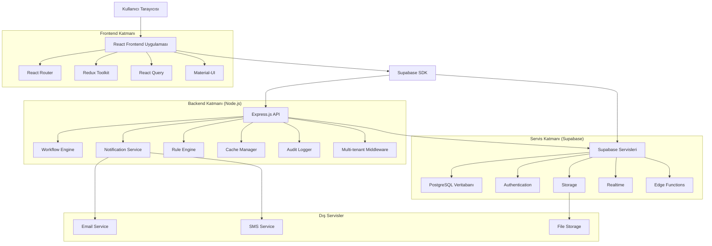
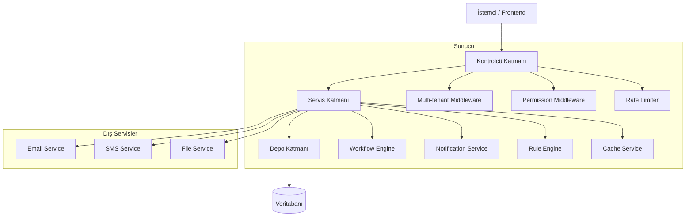
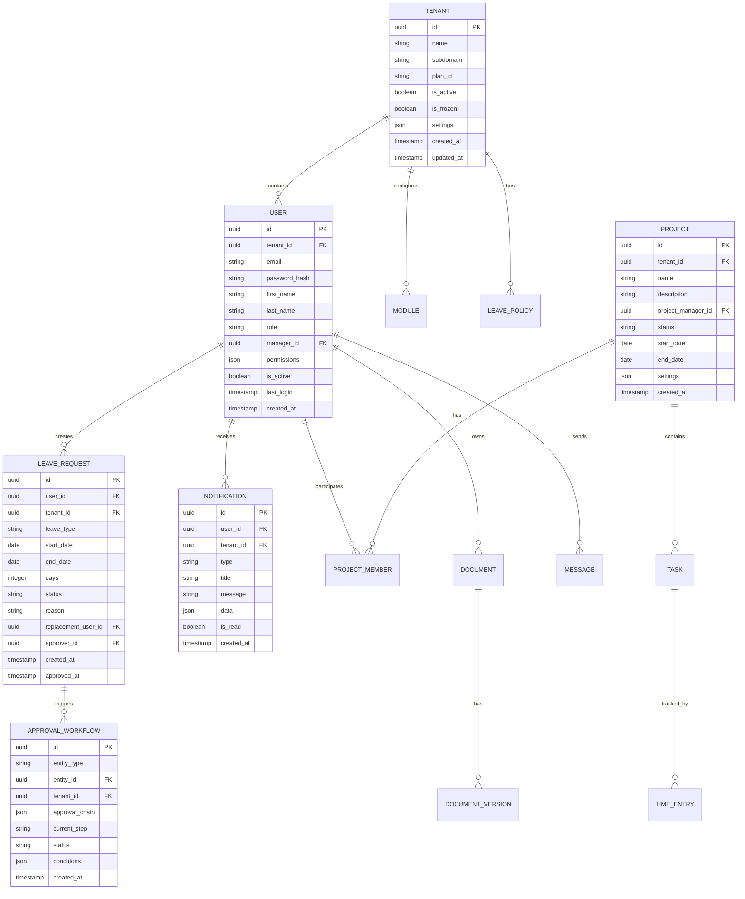

# CoreFly v1 - Teknik Mimarisi

## 1. Mimarisi Tasarımı



## 2. Teknoloji Tanımları

- **Frontend**: React@18 + TypeScript + Vite
- **UI Framework**: Material-UI@5 + TailwindCSS@3
- **State Management**: Redux Toolkit + React Query
- **Backend**: Node.js@18 + Express.js@4
- **Veritabanı**: Supabase (PostgreSQL@15)
- **Cache**: Redis@7
- **Realtime**: Supabase Realtime
- **Başlatma Aracı**: vite-init
- **Deployment**: Docker + Kubernetes

## 3. Rota Tanımları

| Rota | Amaç |
|------|------|
| / | Giriş sayfası, kullanıcı doğrulama |
| /dashboard | Ana dashboard, kişisel özet |
| /announcements | Haber ve duyuru listesi |
| /messaging | Mesajlaşma arayüzü |
| /profile/:id | Kullanıcı profili görüntüleme |
| /leave-management | İzin talepleri ve takibi |
| /project-management | Proje listesi ve yönetimi |
| /kanban | Görev yönetimi kanban tahtası |
| /documents | Doküman yönetim sistemi |
| /helpdesk | Destek talepleri |
| /reports | Raporlar ve analizler |
| /admin/tenant | Tenant yönetim paneli |
| /admin/users | Kullanıcı yönetimi |
| /admin/modules | Modül kontrol paneli |
| /root/console | Root yönetim dashboard |
| /root/tenants | Global tenant yönetimi |
| /root/security | Güvenlik ve audit logları |
| /root/analytics | Sistem analitikleri |

## 4. API Tanımları

### 4.1 Kimlik Doğrulama API'leri

```
POST /api/auth/login
```

İstek:
| Parametre | Tip | Zorunlu | Açıklama |
|-----------|-----|---------|----------|
| email | string | evet | Kullanıcı e-posta adresi |
| password | string | evet | Şifre (hash'lenmiş) |
| tenant_id | string | evet | Tenant kimliği |

Yanıt:
| Parametre | Tip | Açıklama |
|-----------|-----|----------|
| access_token | string | JWT erişim token'ı |
| refresh_token | string | Yenileme token'ı |
| user | object | Kullanıcı bilgileri |
| permissions | array | Kullanıcı yetkileri |

### 4.2 İzin Yönetimi API'leri

```
POST /api/leave/request
```

İstek:
| Parametre | Tip | Zorunlu | Açıklama |
|-----------|-----|---------|----------|
| leave_type | string | evet | İzin türü (annual, sick, etc.) |
| start_date | date | evet | Başlangıç tarihi |
| end_date | date | evet | Bitiş tarihi |
| reason | string | hayır | Açıklama |
| replacement_user_id | string | hayır | Yerine bakacak kişi |

```
GET /api/leave/balance/:user_id
```

Yanıt:
| Parametre | Tip | Açıklama |
|-----------|-----|----------|
| annual_leave | number | Yıllık izin bakiyesi |
| used_leave | number | Kullanılan izin günü |
| remaining_leave | number | Kalan izin günü |
| pending_requests | number | Onay bekleyen talepler |

### 4.3 Multi-tenant API'leri

```
POST /api/admin/tenant/create
```

İstek:
| Parametre | Tip | Zorunlu | Açıklama |
|-----------|-----|---------|----------|
| name | string | evet | Tenant adı |
| subdomain | string | evet | Alt alan adı |
| plan_id | string | evet | Abonelik planı |
| admin_email | string | evet | Admin e-posta |
| max_users | number | evet | Maksimum kullanıcı sayısı |

```
PUT /api/admin/tenant/:id/freeze
```

İstek:
| Parametre | Tip | Zorunlu | Açıklama |
|-----------|-----|---------|----------|
| reason | string | evet | Dondurma nedeni |
| freeze_duration | number | hayır | Dakika cinsinden süre |

## 5. Sunucu Mimarisi Diyagramı



## 6. Veri Modeli

### 6.1 Veri Modeli Tanımlaması



### 6.2 Veri Tanım Dili (DDL)

**Tenant Tablosu (tenants)**
```sql
-- tablo oluşturma
CREATE TABLE tenants (
    id UUID PRIMARY KEY DEFAULT gen_random_uuid(),
    name VARCHAR(255) NOT NULL,
    subdomain VARCHAR(100) UNIQUE NOT NULL,
    plan_id VARCHAR(50) NOT NULL,
    max_users INTEGER DEFAULT 100,
    max_storage_gb INTEGER DEFAULT 10,
    is_active BOOLEAN DEFAULT true,
    is_frozen BOOLEAN DEFAULT false,
    frozen_reason TEXT,
    frozen_until TIMESTAMP,
    settings JSONB DEFAULT '{}',
    created_at TIMESTAMP WITH TIME ZONE DEFAULT NOW(),
    updated_at TIMESTAMP WITH TIME ZONE DEFAULT NOW()
);

-- indeksler
CREATE INDEX idx_tenants_subdomain ON tenants(subdomain);
CREATE INDEX idx_tenants_plan ON tenants(plan_id);
CREATE INDEX idx_tenants_active ON tenants(is_active);
```

**Kullanıcı Tablosu (users)**
```sql
-- tablo oluşturma
CREATE TABLE users (
    id UUID PRIMARY KEY DEFAULT gen_random_uuid(),
    tenant_id UUID NOT NULL REFERENCES tenants(id) ON DELETE CASCADE,
    email VARCHAR(255) NOT NULL,
    password_hash VARCHAR(255) NOT NULL,
    first_name VARCHAR(100) NOT NULL,
    last_name VARCHAR(100) NOT NULL,
    employee_id VARCHAR(50),
    department VARCHAR(100),
    position VARCHAR(100),
    role VARCHAR(50) DEFAULT 'employee',
    manager_id UUID REFERENCES users(id),
    permissions JSONB DEFAULT '{}',
    is_active BOOLEAN DEFAULT true,
    email_verified BOOLEAN DEFAULT false,
    last_login TIMESTAMP,
    created_at TIMESTAMP WITH TIME ZONE DEFAULT NOW(),
    updated_at TIMESTAMP WITH TIME ZONE DEFAULT NOW(),
    UNIQUE(tenant_id, email)
);

-- indeksler
CREATE INDEX idx_users_tenant_id ON users(tenant_id);
CREATE INDEX idx_users_email ON users(email);
CREATE INDEX idx_users_manager ON users(manager_id);
CREATE INDEX idx_users_active ON users(is_active);
```

**İzin Talepleri Tablosu (leave_requests)**
```sql
-- tablo oluşturma
CREATE TABLE leave_requests (
    id UUID PRIMARY KEY DEFAULT gen_random_uuid(),
    tenant_id UUID NOT NULL REFERENCES tenants(id) ON DELETE CASCADE,
    user_id UUID NOT NULL REFERENCES users(id) ON DELETE CASCADE,
    leave_type VARCHAR(50) NOT NULL,
    start_date DATE NOT NULL,
    end_date DATE NOT NULL,
    days INTEGER NOT NULL,
    status VARCHAR(20) DEFAULT 'pending',
    reason TEXT,
    replacement_user_id UUID REFERENCES users(id),
    approver_id UUID REFERENCES users(id),
    approval_note TEXT,
    approved_at TIMESTAMP,
    created_at TIMESTAMP WITH TIME ZONE DEFAULT NOW(),
    updated_at TIMESTAMP WITH TIME ZONE DEFAULT NOW(),
    CONSTRAINT check_dates CHECK (end_date >= start_date),
    CONSTRAINT check_days CHECK (days > 0)
);

-- indeksler
CREATE INDEX idx_leave_requests_tenant ON leave_requests(tenant_id);
CREATE INDEX idx_leave_requests_user ON leave_requests(user_id);
CREATE INDEX idx_leave_requests_status ON leave_requests(status);
CREATE INDEX idx_leave_requests_dates ON leave_requests(start_date, end_date);
```

**Onay Süreçleri Tablosu (approval_workflows)**
```sql
-- tablo oluşturma
CREATE TABLE approval_workflows (
    id UUID PRIMARY KEY DEFAULT gen_random_uuid(),
    tenant_id UUID NOT NULL REFERENCES tenants(id) ON DELETE CASCADE,
    entity_type VARCHAR(50) NOT NULL,
    entity_id UUID NOT NULL,
    workflow_type VARCHAR(50) NOT NULL,
    approval_chain JSONB NOT NULL,
    current_step INTEGER DEFAULT 1,
    status VARCHAR(20) DEFAULT 'pending',
    conditions JSONB DEFAULT '{}',
    created_by UUID NOT NULL REFERENCES users(id),
    created_at TIMESTAMP WITH TIME ZONE DEFAULT NOW(),
    updated_at TIMESTAMP WITH TIME ZONE DEFAULT NOW()
);

-- indeksler
CREATE INDEX idx_approval_workflows_tenant ON approval_workflows(tenant_id);
CREATE INDEX idx_approval_workflows_entity ON approval_workflows(entity_type, entity_id);
CREATE INDEX idx_approval_workflows_status ON approval_workflows(status);
```

## 7. Multi-tenant Mimarisi

### 7.1 Row-level Isolation Stratejisi

Her tabloda `tenant_id` kolonu bulunur ve tüm sorgular bu alan üzerinden filtrelenir:

```sql
-- Supabase RLS (Row Level Security) politikaları
ALTER TABLE leave_requests ENABLE ROW LEVEL SECURITY;

-- Tenant izolasyon politikası
CREATE POLICY tenant_isolation ON leave_requests
    USING (tenant_id = current_setting('app.current_tenant')::uuid);

-- Kullanıcıya özel erişim politikası
CREATE POLICY user_access ON leave_requests
    USING (
        tenant_id = current_setting('app.current_tenant')::uuid 
        AND (
            user_id = auth.uid() 
            OR EXISTS (
                SELECT 1 FROM users 
                WHERE id = auth.uid() 
                AND role IN ('manager', 'admin')
                AND tenant_id = current_setting('app.current_tenant')::uuid
            )
        )
    );
```

### 7.2 Multi-tenant Middleware

```javascript
// Express middleware for tenant detection
const tenantMiddleware = async (req, res, next) => {
    const subdomain = req.get('X-Tenant-Subdomain') || 
                     req.get('host')?.split('.')[0];
    
    if (!subdomain) {
        return res.status(400).json({ error: 'Tenant subdomain required' });
    }
    
    const tenant = await getTenantBySubdomain(subdomain);
    if (!tenant || !tenant.is_active || tenant.is_frozen) {
        return res.status(403).json({ error: 'Tenant access denied' });
    }
    
    req.tenant = tenant;
    req.tenantId = tenant.id;
    
    // Set tenant context for database queries
    await setTenantContext(tenant.id);
    
    next();
};
```

## 8. Root Console Mimarisi

### 8.1 Tenant Freeze/Unfreeze Mekanizması

```javascript
// Tenant freeze workflow
const freezeTenant = async (tenantId, reason, duration) => {
    const tenant = await updateTenant(tenantId, {
        is_frozen: true,
        frozen_reason: reason,
        frozen_until: duration ? new Date(Date.now() + duration * 60000) : null
    });
    
    // Notify all tenant users
    await broadcastNotification(tenantId, {
        type: 'system_maintenance',
        title: 'Sistem Bakımı',
        message: `Platform ${duration ? duration + ' dakika' : 'süresiz'} bakım moduna alınmıştır.`
    });
    
    // Revoke all active sessions
    await revokeAllSessions(tenantId);
    
    return tenant;
};
```

### 8.2 Global Duyuru Sistemi

```javascript
// Global announcement system
const createGlobalAnnouncement = async (announcement) => {
    const tenants = await getActiveTenants();
    
    for (const tenant of tenants) {
        await createTenantAnnouncement(tenant.id, {
            ...announcement,
            is_global: true,
            priority: 'high'
        });
    }
    
    // Send email notifications to tenant admins
    await notifyTenantAdmins(announcement);
};
```

### 8.3 Impersonation Güvenlik Kuralları

```javascript
// Impersonation security rules
const impersonateUser = async (rootUserId, targetUserId) => {
    // Verify root user permissions
    const rootUser = await getUser(rootUserId);
    if (rootUser.role !== 'platform_owner') {
        throw new Error('Insufficient permissions');
    }
    
    // Log impersonation attempt
    await logAuditEvent({
        event: 'user_impersonation',
        actor_id: rootUserId,
        target_id: targetUserId,
        timestamp: new Date(),
        ip_address: getClientIP()
    });
    
    // Create impersonation session
    const session = await createImpersonationSession(rootUserId, targetUserId);
    
    return session;
};
```

## 9. Cache Stratejisi

### 9.1 Multi-level Cache

```javascript
// Cache hierarchy
const cacheConfig = {
    // L1: Browser cache
    browser: {
        static: '1d',
        api: '5m'
    },
    // L2: CDN cache
    cdn: {
        static: '1d',
        api: '1m'
    },
    // L3: Redis cache
    redis: {
        session: '2h',
        tenant: '1h',
        user: '30m',
        permissions: '15m'
    }
};
```

### 9.2 Cache Invalidation

```javascript
// Cache invalidation on tenant update
const invalidateTenantCache = async (tenantId) => {
    await redis.del(`tenant:${tenantId}`);
    await redis.del(`tenant:${tenantId}:users`);
    await redis.del(`tenant:${tenantId}:modules`);
    await redis.del(`tenant:${tenantId}:settings`);
    
    // Broadcast cache invalidation to all services
    await publishCacheInvalidation('tenant', tenantId);
};
```

## 10. Log Pipeline

### 10.1 Structured Logging

```javascript
// Winston logger configuration
const logger = winston.createLogger({
    format: winston.format.combine(
        winston.format.timestamp(),
        winston.format.errors({ stack: true }),
        winston.format.json()
    ),
    defaultMeta: { 
        service: 'corefly-api',
        environment: process.env.NODE_ENV
    },
    transports: [
        new winston.transports.File({ filename: 'error.log', level: 'error' }),
        new winston.transports.File({ filename: 'combined.log' }),
        new winston.transports.Console({
            format: winston.format.simple()
        })
    ]
});
```

### 10.2 Audit Logging

```sql
-- Audit log table
CREATE TABLE audit_logs (
    id UUID PRIMARY KEY DEFAULT gen_random_uuid(),
    tenant_id UUID NOT NULL REFERENCES tenants(id) ON DELETE CASCADE,
    user_id UUID REFERENCES users(id) ON DELETE SET NULL,
    action VARCHAR(100) NOT NULL,
    entity_type VARCHAR(50) NOT NULL,
    entity_id UUID,
    old_values JSONB,
    new_values JSONB,
    ip_address INET,
    user_agent TEXT,
    created_at TIMESTAMP WITH TIME ZONE DEFAULT NOW()
);

CREATE INDEX idx_audit_logs_tenant ON audit_logs(tenant_id);
CREATE INDEX idx_audit_logs_user ON audit_logs(user_id);
CREATE INDEX idx_audit_logs_action ON audit_logs(action);
CREATE INDEX idx_audit_logs_created ON audit_logs(created_at DESC);
```