# CoreFly Enterprise - Kurumsal Yönetim Sistemi (ERP & OperationOS)

<div align="center">


[](https://php.net)
[](https://reactjs.org)
[](https://www.typescriptlang.org)
[](https://vitejs.dev)
[](https://github.com/satlasco/CoreFly)
[](https://gib.gov.tr)
[](https://webrtc.org)

<p align="center">
  <b>Modern şirketler, holdingler, STK'lar ve operasyonel organizasyonlar için geliştirilmiş uçtan uca çok kiracılı (multi-tenant) kurumsal kaynak planlama (ERP) ve operasyon işletim sistemi.</b>
</p>

</div>

---

## 📸 Ekran Görüntüleri & Görsel Vitrin (Screenshot Gallery)

### 1. Yönetici Panosu & Genel Bakış
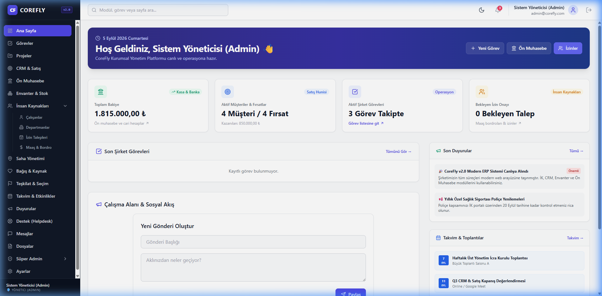

### 2. Resmi GİB E-Fatura & Ön Muhasebe
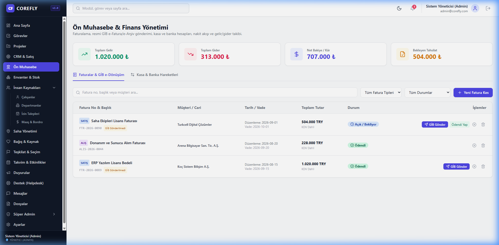

### 3. CRM & Satış Hunisi (Kanban Board)
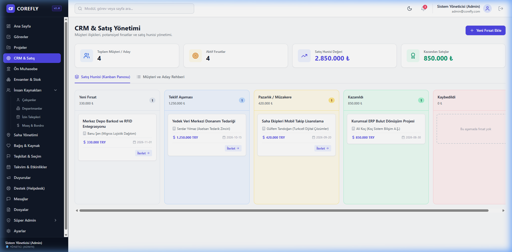

### 4. İnsan Kaynakları & Personel Yönetimi
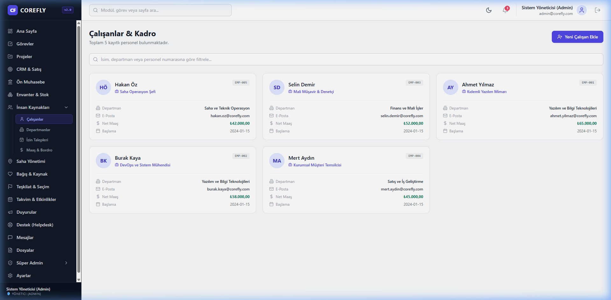

### 5. Mesajlaşma & VoIP Sesli/Görüntülü Çağrı Modülü
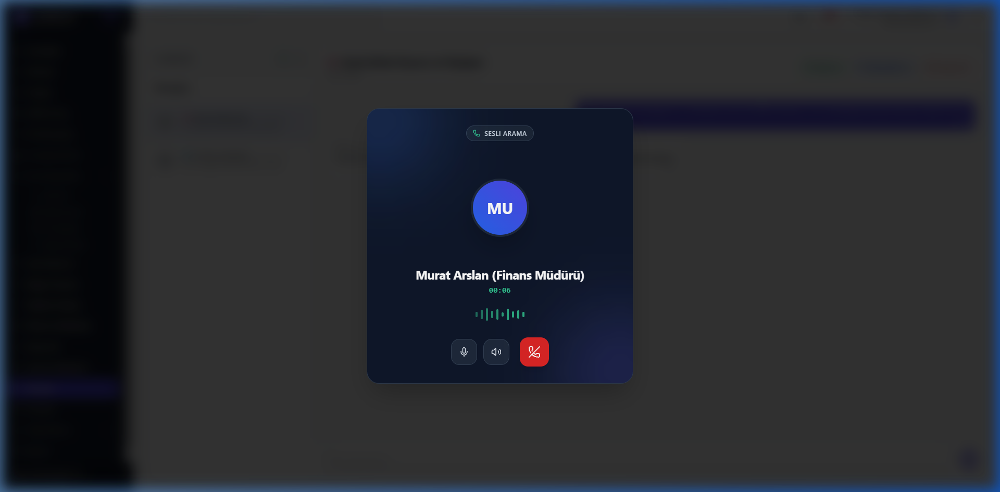

<details>
<summary><b>🔍 Diğer Modüllerin Ekran Görüntülerini İncele (Saha, Bağış, Takvim, Destek, Dosyalar)</b></summary>

| Saha Operasyonları | Bağış & Kaynak Yönetimi |
|:---:|:---:|
| 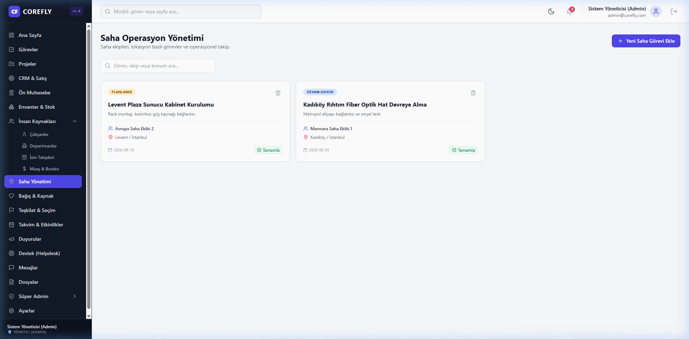 | 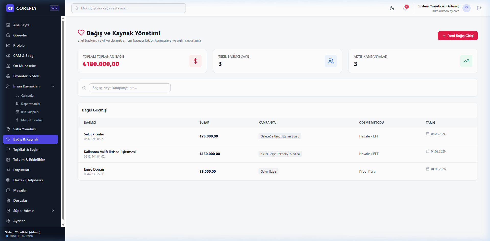 |

| Teşkilat & Sandık Yönetimi | Şirket Takvimi & Etkinlikler |
|:---:|:---:|
| 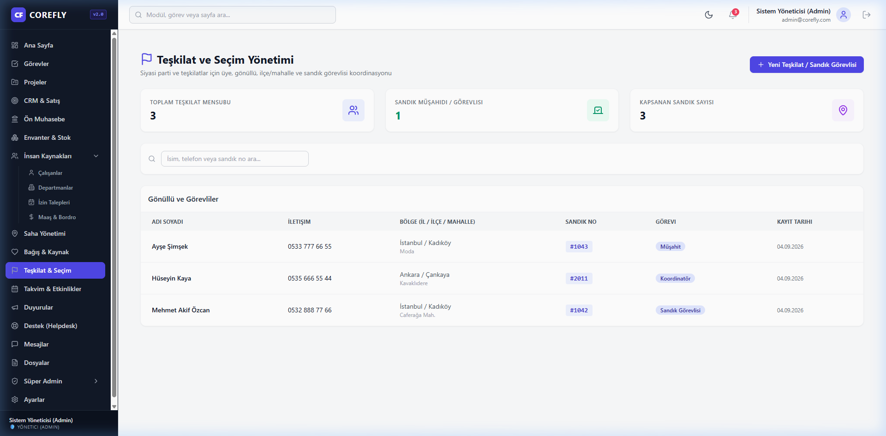 | 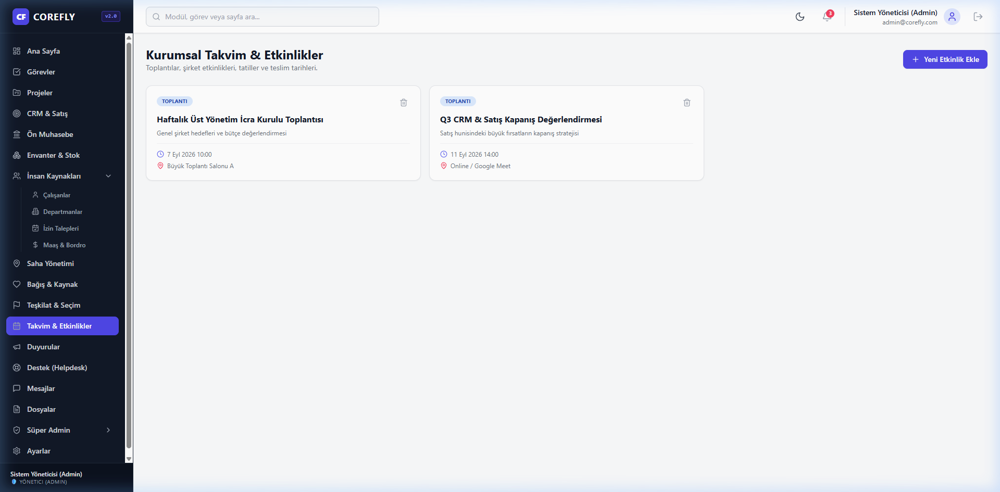 |

| Şirket İçi Duyurular | Destek Masası (Helpdesk) |
|:---:|:---:|
| 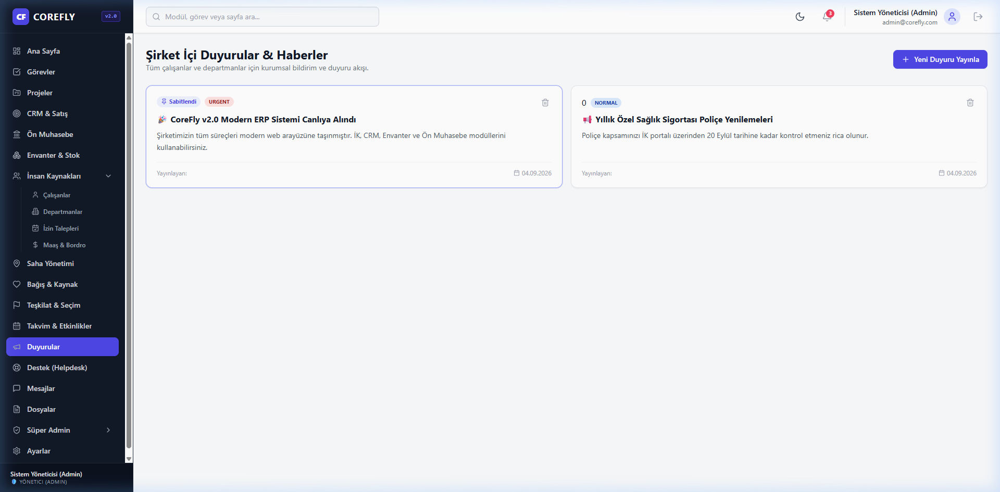 | 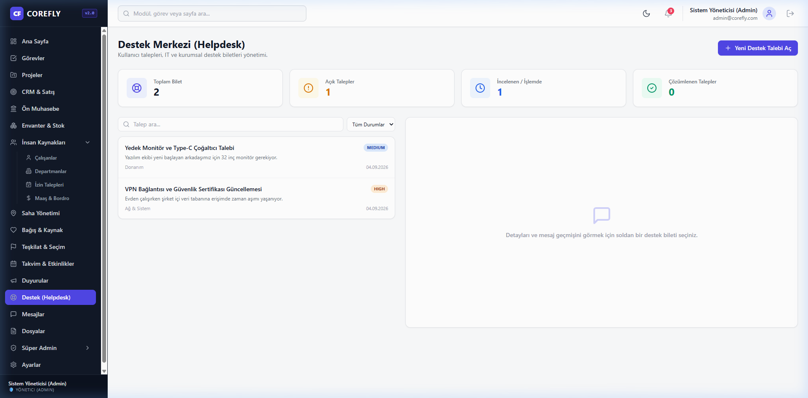 |

| Bulut Dosya Deposu | Kullanıcı & Sistem Ayarları |
|:---:|:---:|
| 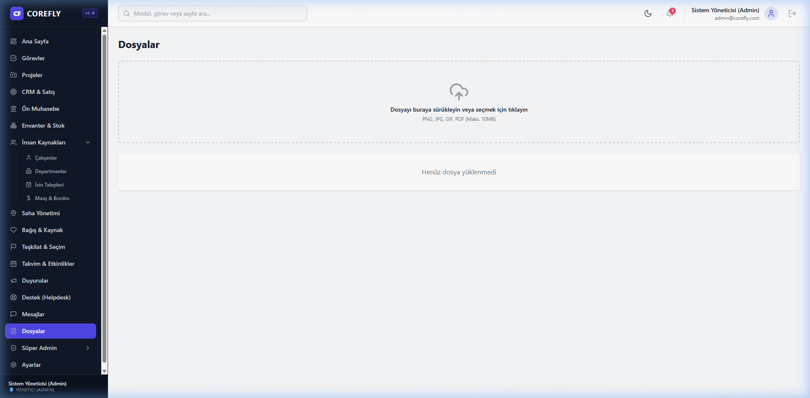 | 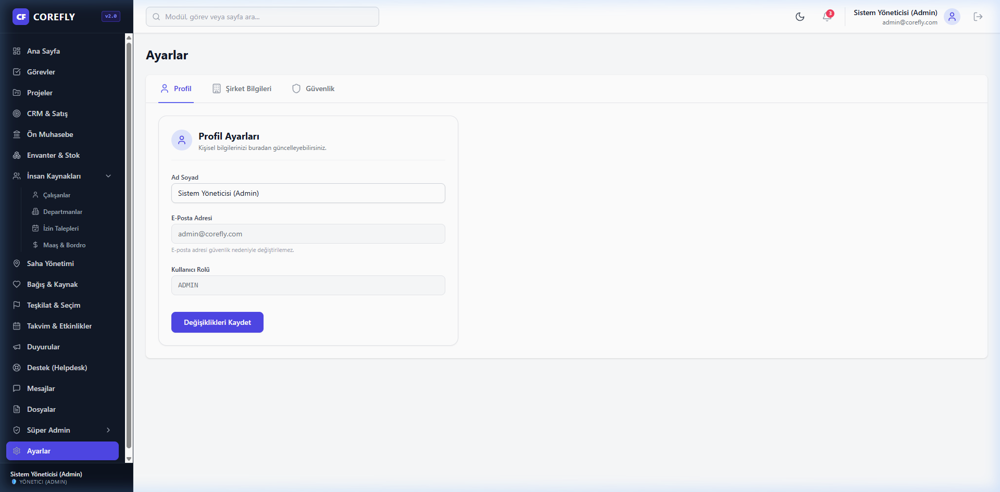 |

</details>

---

## 🏛️ Mimari Yapı ve Teknik Yetenekler

- **Frontend:** React 18, TypeScript, Tailwind CSS, Vite, Lucide Icons, Zustand State Management.
- **Backend:** PHP 8.2+, Katmanlı REST Router, PDO DB Abstraction, JWT Authentication.
- **Veritabanı Motoru:** **SQLite / MySQL / PostgreSQL** çoklu veritabanı desteği (Multi-Tenant Shared Schema & Tenant Isolation).
- **Resmi E-Dönüşüm:** GİB UBL-TR 2.1 Standardı XML Üretimi, ETTN UUID v4, Resmi HTML Önizleme, Karekod ve Entegratör Köprüsü.
- **İletişim & VoIP:** WebRTC tabanlı kullanıcılar arası sesli ve görüntülü arama, gerçek zamanlı ses dalgası animasyonu (Audio Visualizer), kamera önizleme ve çağrı geçmişi.
- **Tasarım & Deneyim:** Karanlık ve Aydınlık Mod (Dark/Light Mode), Toast Bildirim Sistemi (`useToast`), Dinamik Sayfalama (Pagination).
- **Güvenlik & Uyumluluk:** RBAC Rol/Yetki İzolasyonu, Kapsamlı Denetim Günlükleri (Audit Logs), HTTP Security Headers (CORS, CSP, Permissions-Policy).

---

## 🗄️ Çoklu Veritabanı Desteği (Multi-Database Support)

CoreFly, kodda tek bir satır değişiklik yapmadan yalnızca `.env` dosyası üzerinden 3 farklı veritabanı motoruna bağlanabilir:

### 1. SQLite (Hafif ve Hızlı - Geliştirme Ortamı)
```env
DB_CONNECTION=sqlite
DB_DATABASE=storage/database/corefly.sqlite
```

### 2. MySQL / MariaDB (Kurumsal Web Hosting & Cloud RDS)
```env
DB_CONNECTION=mysql
DB_HOST=127.0.0.1
DB_PORT=3306
DB_DATABASE=corefly
DB_USERNAME=root
DB_PASSWORD=your_password
DB_CHARSET=utf8mb4
```

### 3. PostgreSQL (Kurumsal Büyük Ölçek & Cloud Aurora / Supabase)
```env
DB_CONNECTION=pgsql
DB_HOST=127.0.0.1
DB_PORT=5432
DB_DATABASE=corefly
DB_USERNAME=postgres
DB_PASSWORD=your_password
DB_SCHEMA=public
```

*Veritabanı bağlantı durumunu test etmek için:*
```bash
php scripts/test_db_connection.php
```

---

## 🧾 Resmi GİB E-Fatura & E-Arşiv Altyapısı

CoreFly Ön Muhasebe modülü, şirket içi tahsilat ve faturalandırmanın ötesinde **Gelir İdaresi Başkanlığı (GİB) mevzuatına %100 uyumlu** e-Fatura ve e-Arşiv altyapısı sunar:

1. **Evrensel Tekil Tanımlayıcı (ETTN - UUID v4):** Her fatura için resmi benzersiz ETTN otomatik oluşturulur.
2. **UBL-TR 2.1 Standart XML:** GİB UBL-TR 2.1 şemasına uygun VKN/TCKN, KDV matrahı, istisna kodları ve kalem dökümleri üretilir.
3. **Resmi Görsel Şablon (HTML & Baskı):** Resmi GİB barkod/karekod alanı, "YALNIZ ... TÜRK LİRASI" resmi yazıya çevirme motoru ve yazdırılabilir fatura görseli mevcuttur.
4. **Entegratör Köprüsü (GİB Gateway):** QNB e-Finans, Sovos, Digital Planet veya GİB Portal entegratör API'lerine bağlanmaya hazır servis mimarisi.
5. **Kullanıcı Deneyimi:** Tek tıkla "GİB'e Gönder", resmi görseli modalda yazdırma ("Yazdır") ve resmi imzalı `.xml` dosyasını tek tıkla indirme imkanı.

---

## 📞 VoIP & Görüntülü Arama Modülü (WebRTC Calling)

Çalışanlar arası dahili sesli ve görüntülü iletişim:
- **Sesli Arama:** Audio Visualizer dalgalanma animasyonu, sessize alma (`Mute`), hoparlör kontrolü.
- **Görüntülü Arama:** Yerel ve uzak kamera akışı (`navigator.mediaDevices.getUserMedia`), kamera aç/kapatma.
- **Gelen Arama Bildirimi:** Ekran üzerinde sesli zil animasyonu, anında kabul etme veya reddetme.
- **Çağrı Geçmişi:** Yapılan ve alınan tüm görüşmelerin süre, zaman ve durum kayıtları.

---

## 📦 Kapsamlı Modül Kataloğu

| Modül | Sayfa Rotası | Açıklama |
|---|---|---|
| **Yönetici Panosu** | `/dashboard` | Finans, CRM, Görev, İK KPI kartları ve son aktiviteler |
| **Şirket Görevleri** | `/tasks` | Projeden bağımsız kurumsal operasyon görevleri ve durum filtreleri |
| **Projeler & Kanban** | `/projects`, `/projects/:id` | Proje yönetimi, aşamalı Kanban görev kartları, üye atama |
| **CRM & Satış** | `/crm` | Müşteri portföyü, Satış Hunisi (Deals), aktivite takibi |
| **Ön Muhasebe & e-Fatura** | `/accounting` | Kasa/Banka hesapları, Resmi GİB e-Fatura & e-Arşiv, Gelir-Gider hareketleri |
| **Envanter & Stok** | `/inventory` | Donanım/ürün takibi, stok hareketleri, Tedarikçiler cari rehberi |
| **İnsan Kaynakları** | `/hr/employees` | Personel listesi, yeni çalışan ekleme modalı |
| **Departmanlar** | `/hr/departments` | Şirket departmanları ve organizasyon şeması |
| **İzin Talepleri** | `/hr/leaves` | Yıllık izin, mazeret ve hastalık izin onay süreçleri |
| **Maaş & Bordro** | `/hr/payrolls` | Aylık maaş bordrosu, net maaş ve prim dökümleri |
| **Saha Yönetimi** | `/field` | Saha operasyonları, ekip atamaları ve görev durumları |
| **Bağış & Kaynak** | `/donations` | STK bağışçı kayıtları ve fon kampanyaları |
| **Teşkilat & Sandık** | `/politics` | İl/ilçe gönüllüleri ve sandık görevlileri organizasyonu |
| **Takvim & Etkinlikler**| `/calendar` | Şirket toplantıları, son teslim tarihleri |
| **Şirket Duyuruları** | `/announcements` | Kurumsal duyurular ve acil haber akışı |
| **Destek Masası** | `/helpdesk` | Dahili destek biletleri (Tickets) ve mesajlaşma |
| **Anlık Mesajlaşma & VoIP** | `/messages` | Çalışanlar arası mesajlaşma, sesli ve görüntülü arama |
| **Dosya Deposu** | `/files` | Dosya yükleme, güvenli indirme ve silme |
| **Süper Admin (RBAC)**| `/admin/roles` | Rol ve yetki izin matrisi yönetimi (Yalnızca Admin) |
| **Denetim Günlükleri** | `/admin/logs` | Sistem güvenlik ve işlem denetim izleri (Yalnızca Admin) |
| **Kiracı Yönetimi** | `/admin/tenants` | Çoklu kiracı (SaaS Tenant) yönetimi (Yalnızca Admin) |
| **Profil & Güvenlik** | `/settings/profile`, `/settings/security` | Profil düzenleme ve şifre değiştirme |

---

## ⚡ Hızlı Başlangıç & Kurulum

### 1. Gereksinimler
- PHP 8.2 veya üzeri (PDO, pdo_sqlite, pdo_mysql, pdo_pgsql eklentileri)
- Node.js 18+ ve npm
- Composer (isteğe bağlı)

### 2. Veritabanını Hazırlama
```bash
# Migration'ları yürüt (26 migration otomatik uygulanır)
php scripts/migrate.php

# Varsayılan demo verilerini ve admin kullanıcısını yükle
php scripts/seed_full_stack.php
```

### 3. Backend API Sunucusunu Başlatma
```bash
php -S 127.0.0.1:8001 -t public
```

### 4. Frontend Geliştirme Sunucusunu Başlatma
```bash
cd frontend
npm install
npm run dev
```
Uygulama **`http://localhost:5173`** adresinde açılacaktır.

### 5. Varsayılan Giriş Bilgileri
- **E-Posta:** `admin@corefly.com`
- **Şifre:** `Admin123!`

---

## 🧪 Otomatik Test Paketi

Sistemdeki tüm modülleri terminal üzerinden test edebilirsiniz:
```bash
# E-Fatura UBL-TR XML ve Durum Testi
php scripts/test_einvoice.php

# VoIP & Görüntülü Arama Uçtan Uca Testi
php scripts/test_call_e2e.php

# Tüm Faz ve Modüllerin Doğrulama Testi
php scripts/test_all_phases.php
```

---

## 📄 Lisans ve Telif Hakkı

CoreFly Enterprise, ticari ve kurumsal kullanıma uygun olarak lisanslanmıştır.  
© 2026 CoreFly Group. Tüm hakları saklıdır.
