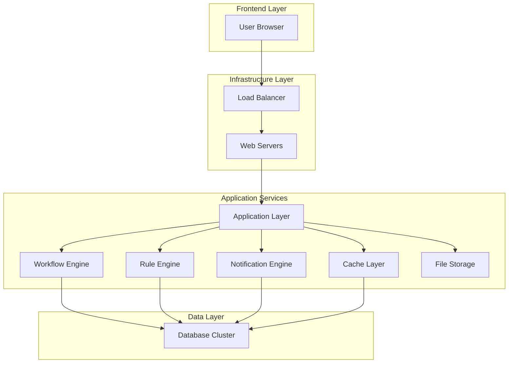
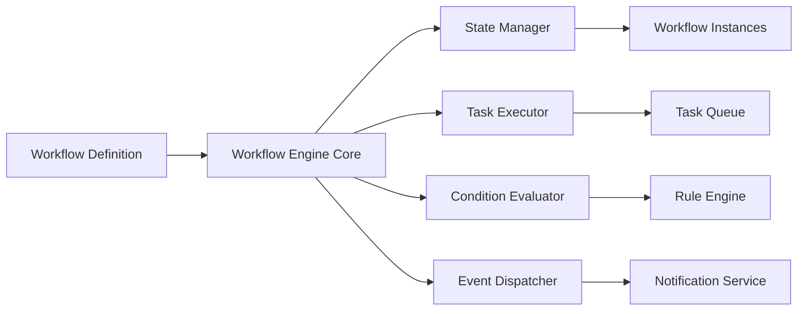
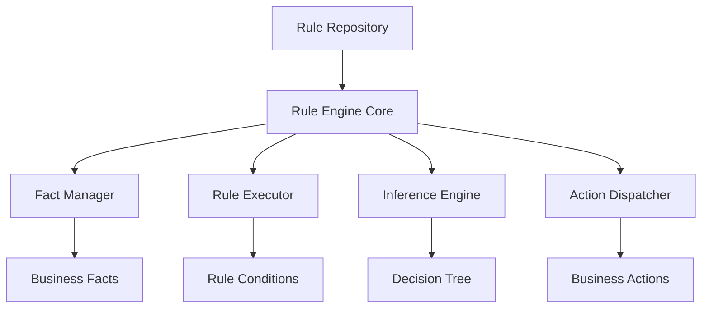
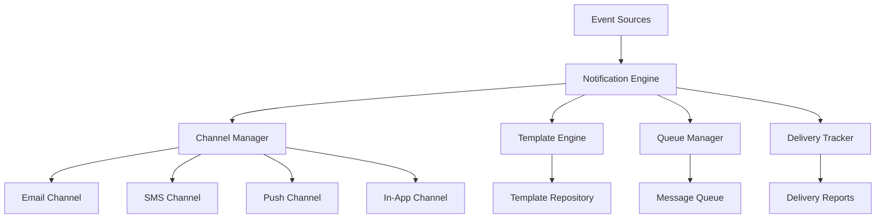
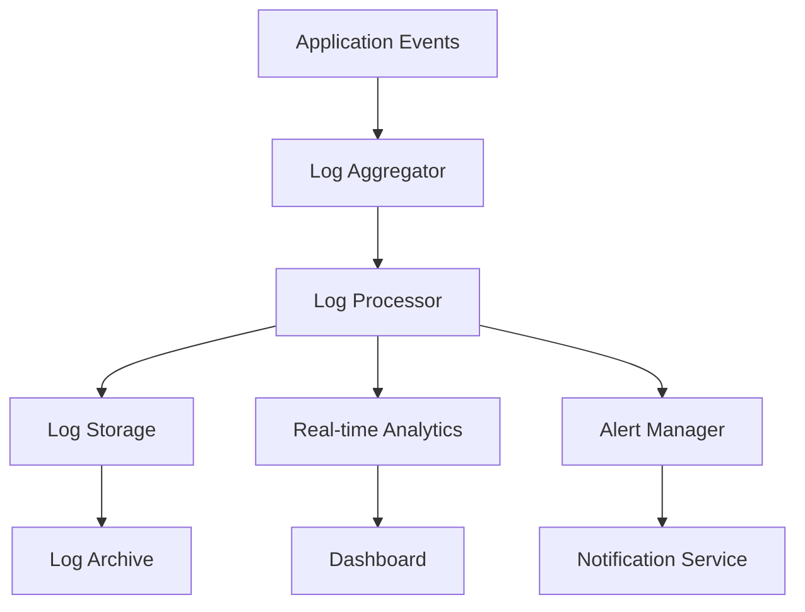
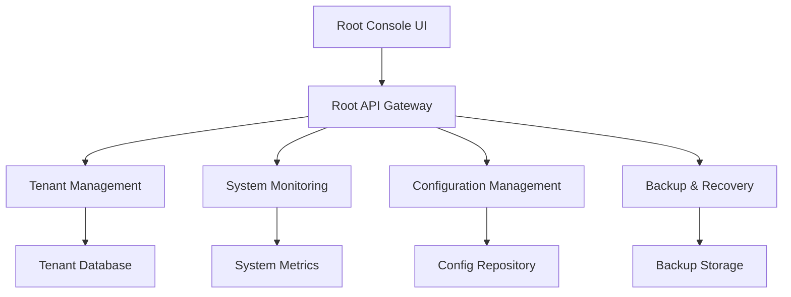

# CoreFly – Enterprise Technical Architecture (Full Multi-Tenant Blueprint)

## 1. Architecture Overview

CoreFly, enterprise düzeyinde çoklu kiracı (multi-tenant) bir iş yönetim platformudur. 57 farklı modülden oluşan bu yapı, modüler PHP mimarisi ile tasarlanmıştır ve yüksek ölçeklenebilirlik, güvenlik ve performans hedeflerini karşılamaktadır.

### Temel Hedefler:
- Çoklu kiracı izolasyonu ile veri güvenliği
- Rol tabanlı erişim kontrolü (RBAC)
- Modüler ve genişletilebilir yapı
- Yüksek performanslı workflow ve rule motorları
- Kapsamlı log ve audit sistemi

## 2. System Architecture



## 3. Tenant Isolation Model

### 3.1 Veritabanı İzolasyonu
CoreFly üç farklı tenant izolasyon modelini destekler:

#### Model 1: Shared Database, Shared Schema (Varsayılan)
- Tüm kiracılar aynı veritabanını ve şemayı paylaşır
- Tenant ID ile veri izolasyonu sağlanır
- Düşük maliyet, yüksek verimlilik
- Uygulama seviyesinde güvenlik kontrolleri

#### Model 2: Shared Database, Separate Schema
- Her kiracıya ayrı şema
- Ortak veritabanı altyapısı
- Orta düzeyde izolasyon
- Şema başına yedekleme ve geri yükleme

#### Model 3: Separate Database
- Her kiracıya tamamen ayrı veritabanı
- Maksimum izolasyon ve güvenlik
- Yüksek maliyet, karmaşık yönetim
- Finans ve sağlık sektörü için ideal

### 3.2 Karar Matrisi
| Kriter | Model 1 | Model 2 | Model 3 |
|--------|---------|---------|---------|
| Maliyet | Düşük | Orta | Yüksek |
| İzolasyon | Orta | Yüksek | Maksimum |
| Ölçeklenebilirlik | Yüksek | Orta | Düşük |
| Yönetim Karmaşıklığı | Düşük | Orta | Yüksek |
| Önerilen Kullanım | SMB | Enterprise | Finans/Sağlık |

## 4. Role-Based Access Control (RBAC)

### 4.1 Hiyerarşik Rol Yapısı
```
Root Admin
├── Tenant Admin
│   ├── Department Manager
│   │   ├── Team Lead
│   │   └── Team Member
│   └── Module Admin
└── System Admin
```

### 4.2 Permission Matrisi
| Rol Seviyesi | Sistem Yönetimi | Tenant Yönetimi | Modül Erişimi | Veri Erişimi |
|--------------|------------------|------------------|----------------|---------------|
| Root Admin | Full | Full | Full | All Tenants |
| Tenant Admin | None | Own Tenant | Configurable | Own Tenant |
| Department Manager | None | Sub-departments | Assigned | Department |
| Team Lead | None | Own Team | Assigned | Team |
| Team Member | None | None | Assigned | Own Data |

## 5. Modular PHP Architecture

### 5.1 Katmanlı Mimari
```
Presentation Layer
├── Controllers
├── Views
└── Assets

Business Logic Layer
├── Services
├── Managers
└── Validators

Data Access Layer
├── Repositories
├── Models
└── Data Mappers

Infrastructure Layer
├── Cache
├── Queue
├── File Storage
└── External APIs
```

### 5.2 Modül Yapısı
Her modül aşağıdaki yapıya sahiptir:
```
/modules/{module_name}/
├── Controllers/
├── Models/
├── Services/
├── Views/
├── Config/
├── Assets/
├── Tests/
└── Migrations/
```

## 6. Workflow Engine Design

### 6.1 Workflow Engine Mimarisi


### 6.2 Workflow Bileşenleri

#### Workflow Definition
- JSON/XML tabanlı tanımlama
- State machine mantığı
- Conditional branching
- Parallel execution support

#### Task Types
- **User Task**: Manuel kullanıcı eylemi gerektiren görevler
- **Service Task**: Otomatik sistem görevleri
- **Script Task**: Özel script çalıştıran görevler
- **Email Task**: E-posta gönderen görevler
- **Approval Task**: Onay süreçleri

#### State Management
- Workflow instance lifecycle
- Task durum takibi
- Timeout management
- Rollback mekanizmaları

### 6.3 Workflow Örnekleri
```json
{
  "workflowDefinition": {
    "id": "leave_request",
    "name": "Leave Request Approval",
    "states": [
      {
        "id": "draft",
        "name": "Draft",
        "transitions": [
          {
            "to": "pending_manager",
            "condition": "submitted === true"
          }
        ]
      },
      {
        "id": "pending_manager",
        "name": "Pending Manager Approval",
        "tasks": [
          {
            "type": "approval",
            "assignee": "manager",
            "dueDate": "+3 days"
          }
        ]
      }
    ]
  }
}
```

## 7. Rule-Based Intelligence Engine

### 7.1 Rule Engine Mimarisi


### 7.2 Rule Tanımlama
#### Rule Structure
```json
{
  "rule": {
    "id": "expense_limit",
    "name": "Expense Approval Limit",
    "conditions": [
      {
        "fact": "user.role",
        "operator": "equals",
        "value": "employee"
      },
      {
        "fact": "expense.amount",
        "operator": "greater_than",
        "value": 1000
      }
    ],
    "actions": [
      {
        "type": "require_approval",
        "params": {
          "approver": "manager"
        }
      }
    ]
  }
}
```

#### Rule Types
- **Validation Rules**: Veri doğrulama kuralları
- **Business Rules**: İş mantığı kuralları
- **Workflow Rules**: Workflow geçiş kuralları
- **Notification Rules**: Bildirim tetikleme kuralları

### 7.3 Inference Engine
- Forward chaining: Olaydan sonuca
- Backward chaining: Sonuçtan olaya
- Rule prioritization: Öncelik sıralaması
- Conflict resolution: Çakışma çözümleme

## 8. Notification Engine

### 8.1 Notification Mimarisi


### 8.2 Notification Türleri
#### Channel Types
- **Email**: SMTP/API entegrasyonu
- **SMS**: SMS gateway entegrasyonu
- **Push**: Mobile push notifications
- **In-App**: Uygulama içi bildirimler
- **Webhook**: Dış sistem entegrasyonu

#### Notification Templates
```json
{
  "template": {
    "id": "task_assigned",
    "channels": ["email", "in_app"],
    "subject": "New Task Assigned: {{task_title}}",
    "content": {
      "email": "Dear {{user_name}},\n\nYou have been assigned a new task: {{task_title}}\n\nDue date: {{due_date}}\n\nBest regards,\nCoreFly Team",
      "in_app": "{{user_name}}, you have a new task: {{task_title}}"
    }
  }
}
```

### 8.3 Notification Workflow
1. **Event Detection**: Sistem olaylarını yakalama
2. **Rule Evaluation**: Bildirim kurallarını değerlendirme
3. **Template Processing**: Şablonları kişiselleştirme
4. **Channel Selection**: Uygun kanalları seçme
5. **Queue Management**: Mesaj kuyruğu yönetimi
6. **Delivery Tracking**: Teslimat durumu takibi

## 9. Log & Audit Systems

### 9.1 Log Mimarisi


### 9.2 Log Türleri
#### Application Logs
- Error logs: Hata kayıtları
- Access logs: Erişim kayıtları
- Performance logs: Performans metrikleri
- Business logs: İş olayları

#### Audit Logs
- User actions: Kullanıcı eylemleri
- Data changes: Veri değişiklikleri
- Permission changes: Yetki değişiklikleri
- System events: Sistem olayları

### 9.3 Log Format
```json
{
  "timestamp": "2024-01-15T10:30:00Z",
  "level": "INFO",
  "tenant_id": "tenant_123",
  "user_id": "user_456",
  "session_id": "session_789",
  "action": "document_create",
  "resource": "document",
  "resource_id": "doc_001",
  "details": {
    "title": "Project Proposal",
    "size": "2MB"
  },
  "ip_address": "192.168.1.1",
  "user_agent": "Mozilla/5.0..."
}
```

## 10. File Storage Architecture

### 10.1 Storage Strategy
#### Multi-tier Storage
- **Hot Storage**: Sık erişilen dosyalar (SSD)
- **Warm Storage**: Orta sıklıkta erişilenler (HDD)
- **Cold Storage**: Nadiren erişilenler (Object Storage)

#### Storage Types
- **Document Storage**: İş dokümanları
- **Media Storage**: Resim, video dosyaları
- **Backup Storage**: Yedekleme dosyaları
- **Archive Storage**: Arşiv dosyaları

### 10.2 File Organization
```
/storage/
├── tenants/
│   └── {tenant_id}/
│       ├── documents/
│       ├── media/
│       ├── temp/
│       └── archive/
├── shared/
│   ├── templates/
│   ├── system/
│   └── public/
└── backups/
    ├── daily/
    ├── weekly/
    └── monthly/
```

## 11. Cache & Rate Limiting

### 11.1 Cache Strategy
#### Cache Layers
- **L1 Cache**: Application memory (Redis)
- **L2 Cache**: Database query cache
- **L3 Cache**: CDN cache

#### Cache Types
- **Session Cache**: Kullanıcı oturum bilgileri
- **Data Cache**: Sık erişilen veriler
- **Template Cache**: Sayfa şablonları
- **API Cache**: API yanıtları

### 11.2 Rate Limiting
#### Limit Types
- **API Rate Limits**: Dakika/saat bazlı istek sınırları
- **User Rate Limits**: Kullanıcı başına istek sınırları
- **IP Rate Limits**: IP adresi başına sınırlar
- **Feature Rate Limits**: Özellik bazlı sınırlar

#### Rate Limiting Algorithm
- Token bucket algorithm
- Sliding window counter
- Fixed window counter

## 12. Root Console Technical Architecture

### 12.1 Root Console Mimarisi


### 12.2 Root Console Features
#### Tenant Management
- Tenant oluşturma ve yapılandırma
- Resource allocation ve limitler
- Tenant migration ve backup
- Multi-tenant monitoring

#### System Monitoring
- Real-time system metrics
- Performance monitoring
- Error tracking and alerting
- Resource utilization

#### Configuration Management
- System-wide configuration
- Feature flags management
- A/B testing setup
- Rollback mechanisms

### 12.3 Security Considerations
- Multi-factor authentication
- Role-based access control
- Audit logging
- Secure communication protocols
- Regular security updates

## 13. Performance & Scalability

### 13.1 Performance Metrics
- Response time: < 200ms (p95)
- Throughput: 10,000 requests/second
- Availability: 99.9% uptime
- Concurrent users: 100,000+

### 13.2 Scalability Strategy
- Horizontal scaling: Load balancer + multiple instances
- Database sharding: Tenant bazlı veri bölümleme
- CDN integration: Static asset delivery
- Microservices: Modül bazlı ölçekleme

## 14. Security Architecture

### 14.1 Security Layers
- Network security: Firewall, VPN
- Application security: OWASP top 10
- Data security: Encryption at rest and in transit
- Identity security: OAuth 2.0, SAML

### 14.2 Compliance
- GDPR compliance for EU
- HIPAA compliance for healthcare
- SOC 2 Type II certification
- ISO 27001 information security

## 15. Deployment Architecture

### 15.1 Environment Strategy
- Development: Developer sandbox
- Staging: Pre-production testing
- Production: Live environment
- Disaster Recovery: Backup environment

### 15.2 CI/CD Pipeline
```
Code Commit → Build → Test → Security Scan → Deploy → Monitor
```

### 15.3 Container Strategy
- Docker containers for application isolation
- Kubernetes for orchestration
- Helm charts for deployment
- GitOps for configuration management

Bu teknik mimari belgesi, CoreFly Enterprise platformunun altyapısını oluşturan tüm kritik bileşenleri kapsamaktadır. Bu belge, yazılım ekibinin sprint 0'a başlaması için zorunlu teknik altyapı dokümantasyonunu sağlamaktadır.