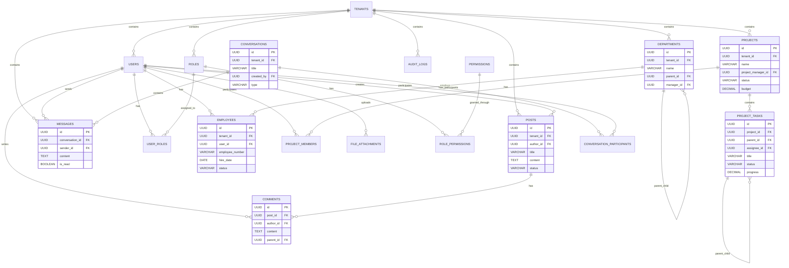

# CoreFly – Global Data Model (Veritabanı Şeması + ER Diagram)

## 1. Overview

CoreFly Enterprise platformu için kapsamlı veritabanı modeli, 57 farklı modülü destekleyecek şekilde tasarlanmıştır. Bu model, çoklu kiracı (multi-tenant) yapısını destekler ve yüksek ölçeklenebilirlik sağlar.

## 2. Tenant Isolation Model

### 2.1 Shared Database, Shared Schema (Varsayılan Model)
Tüm kiracılar aynı veritabanını ve şemayı paylaşır. Her tabloda `tenant_id` kolonu ile veri izolasyonu sağlanır.

```sql
-- Örnek tenant izolasyonu
CREATE TABLE users (
    id UUID PRIMARY KEY DEFAULT gen_random_uuid(),
    tenant_id UUID NOT NULL,
    email VARCHAR(255) NOT NULL,
    -- diğer kolonlar
    created_at TIMESTAMP DEFAULT NOW(),
    
    CONSTRAINT fk_tenant FOREIGN KEY (tenant_id) REFERENCES tenants(id),
    UNIQUE(tenant_id, email)
);

-- Tenant bazlı veri erişimi için policy
CREATE POLICY tenant_isolation ON users
    FOR ALL TO application
    USING (tenant_id = current_tenant_id());
```

## 3. Core Tables (Temel Tablolar)

### 3.1 Tenants (Kiracılar)
```sql
CREATE TABLE tenants (
    id UUID PRIMARY KEY DEFAULT gen_random_uuid(),
    code VARCHAR(50) UNIQUE NOT NULL,
    name VARCHAR(255) NOT NULL,
    status VARCHAR(20) DEFAULT 'active' CHECK (status IN ('active', 'suspended', 'deleted')),
    plan VARCHAR(50) DEFAULT 'basic' CHECK (plan IN ('basic', 'professional', 'enterprise')),
    max_users INTEGER DEFAULT 100,
    max_storage_gb INTEGER DEFAULT 10,
    timezone VARCHAR(50) DEFAULT 'UTC',
    language VARCHAR(10) DEFAULT 'en',
    created_at TIMESTAMP DEFAULT NOW(),
    updated_at TIMESTAMP DEFAULT NOW(),
    deleted_at TIMESTAMP NULL
);
```

### 3.2 Users (Kullanıcılar)
```sql
CREATE TABLE users (
    id UUID PRIMARY KEY DEFAULT gen_random_uuid(),
    tenant_id UUID NOT NULL,
    email VARCHAR(255) NOT NULL,
    username VARCHAR(100) UNIQUE,
    password_hash VARCHAR(255) NOT NULL,
    first_name VARCHAR(100),
    last_name VARCHAR(100),
    avatar_url TEXT,
    phone VARCHAR(20),
    department_id UUID,
    position VARCHAR(100),
    employee_id VARCHAR(50),
    status VARCHAR(20) DEFAULT 'active' CHECK (status IN ('active', 'inactive', 'suspended')),
    email_verified BOOLEAN DEFAULT FALSE,
    phone_verified BOOLEAN DEFAULT FALSE,
    two_factor_enabled BOOLEAN DEFAULT FALSE,
    last_login_at TIMESTAMP,
    last_login_ip INET,
    login_count INTEGER DEFAULT 0,
    preferred_language VARCHAR(10) DEFAULT 'en',
    timezone VARCHAR(50) DEFAULT 'UTC',
    created_at TIMESTAMP DEFAULT NOW(),
    updated_at TIMESTAMP DEFAULT NOW(),
    deleted_at TIMESTAMP NULL,
    
    CONSTRAINT fk_user_tenant FOREIGN KEY (tenant_id) REFERENCES tenants(id) ON DELETE CASCADE,
    CONSTRAINT unique_tenant_email UNIQUE(tenant_id, email)
);
```

### 3.3 Roles (Roller)
```sql
CREATE TABLE roles (
    id UUID PRIMARY KEY DEFAULT gen_random_uuid(),
    tenant_id UUID NOT NULL,
    name VARCHAR(100) NOT NULL,
    description TEXT,
    level INTEGER DEFAULT 1,
    is_system BOOLEAN DEFAULT FALSE,
    is_active BOOLEAN DEFAULT TRUE,
    created_at TIMESTAMP DEFAULT NOW(),
    updated_at TIMESTAMP DEFAULT NOW(),
    
    CONSTRAINT fk_role_tenant FOREIGN KEY (tenant_id) REFERENCES tenants(id) ON DELETE CASCADE,
    CONSTRAINT unique_tenant_role UNIQUE(tenant_id, name)
);
```

### 3.4 Permissions (İzinler)
```sql
CREATE TABLE permissions (
    id UUID PRIMARY KEY DEFAULT gen_random_uuid(),
    module VARCHAR(100) NOT NULL,
    action VARCHAR(100) NOT NULL,
    description TEXT,
    is_system BOOLEAN DEFAULT FALSE,
    created_at TIMESTAMP DEFAULT NOW(),
    
    CONSTRAINT unique_module_action UNIQUE(module, action)
);
```

### 3.5 Role Permissions (Rol İzinleri)
```sql
CREATE TABLE role_permissions (
    id UUID PRIMARY KEY DEFAULT gen_random_uuid(),
    role_id UUID NOT NULL,
    permission_id UUID NOT NULL,
    granted BOOLEAN DEFAULT TRUE,
    created_at TIMESTAMP DEFAULT NOW(),
    
    CONSTRAINT fk_rp_role FOREIGN KEY (role_id) REFERENCES roles(id) ON DELETE CASCADE,
    CONSTRAINT fk_rp_permission FOREIGN KEY (permission_id) REFERENCES permissions(id) ON DELETE CASCADE,
    CONSTRAINT unique_role_permission UNIQUE(role_id, permission_id)
);
```

### 3.6 User Roles (Kullanıcı Rolleri)
```sql
CREATE TABLE user_roles (
    id UUID PRIMARY KEY DEFAULT gen_random_uuid(),
    user_id UUID NOT NULL,
    role_id UUID NOT NULL,
    granted_by UUID,
    granted_at TIMESTAMP DEFAULT NOW(),
    expires_at TIMESTAMP NULL,
    is_active BOOLEAN DEFAULT TRUE,
    
    CONSTRAINT fk_ur_user FOREIGN KEY (user_id) REFERENCES users(id) ON DELETE CASCADE,
    CONSTRAINT fk_ur_role FOREIGN KEY (role_id) REFERENCES roles(id) ON DELETE CASCADE,
    CONSTRAINT fk_ur_granted_by FOREIGN KEY (granted_by) REFERENCES users(id),
    CONSTRAINT unique_user_role UNIQUE(user_id, role_id)
);
```

## 4. Module Categories (Modül Kategorileri)

### 4.1 Workspace & Communication (Modül 1)
#### 4.1.1 Posts (Gönderiler)
```sql
CREATE TABLE posts (
    id UUID PRIMARY KEY DEFAULT gen_random_uuid(),
    tenant_id UUID NOT NULL,
    author_id UUID NOT NULL,
    type VARCHAR(50) DEFAULT 'general' CHECK (type IN ('general', 'announcement', 'news', 'update')),
    title VARCHAR(500),
    content TEXT,
    summary TEXT,
    featured_image_url TEXT,
    status VARCHAR(20) DEFAULT 'draft' CHECK (status IN ('draft', 'published', 'archived')),
    visibility VARCHAR(20) DEFAULT 'public' CHECK (visibility IN ('public', 'internal', 'private')),
    priority VARCHAR(20) DEFAULT 'normal' CHECK (priority IN ('low', 'normal', 'high', 'urgent')),
    target_audience JSONB, -- { departments: [], roles: [], users: [] }
    metadata JSONB,
    published_at TIMESTAMP,
    archived_at TIMESTAMP,
    created_at TIMESTAMP DEFAULT NOW(),
    updated_at TIMESTAMP DEFAULT NOW(),
    
    CONSTRAINT fk_post_tenant FOREIGN KEY (tenant_id) REFERENCES tenants(id) ON DELETE CASCADE,
    CONSTRAINT fk_post_author FOREIGN KEY (author_id) REFERENCES users(id) ON DELETE SET NULL
);
```

#### 4.1.2 Comments (Yorumlar)
```sql
CREATE TABLE comments (
    id UUID PRIMARY KEY DEFAULT gen_random_uuid(),
    tenant_id UUID NOT NULL,
    post_id UUID NOT NULL,
    parent_id UUID NULL,
    author_id UUID NOT NULL,
    content TEXT NOT NULL,
    is_edited BOOLEAN DEFAULT FALSE,
    edited_at TIMESTAMP,
    status VARCHAR(20) DEFAULT 'active' CHECK (status IN ('active', 'hidden', 'deleted')),
    likes_count INTEGER DEFAULT 0,
    created_at TIMESTAMP DEFAULT NOW(),
    updated_at TIMESTAMP DEFAULT NOW(),
    
    CONSTRAINT fk_comment_tenant FOREIGN KEY (tenant_id) REFERENCES tenants(id) ON DELETE CASCADE,
    CONSTRAINT fk_comment_post FOREIGN KEY (post_id) REFERENCES posts(id) ON DELETE CASCADE,
    CONSTRAINT fk_comment_parent FOREIGN KEY (parent_id) REFERENCES comments(id) ON DELETE CASCADE,
    CONSTRAINT fk_comment_author FOREIGN KEY (author_id) REFERENCES users(id) ON DELETE SET NULL
);
```

#### 4.1.3 Messages (Mesajlar)
```sql
CREATE TABLE messages (
    id UUID PRIMARY KEY DEFAULT gen_random_uuid(),
    tenant_id UUID NOT NULL,
    conversation_id UUID NOT NULL,
    sender_id UUID NOT NULL,
    content TEXT NOT NULL,
    content_type VARCHAR(50) DEFAULT 'text' CHECK (content_type IN ('text', 'file', 'image', 'system')),
    attachments JSONB, -- [{ file_id, file_name, file_size, file_type }]
    is_read BOOLEAN DEFAULT FALSE,
    read_at TIMESTAMP,
    is_edited BOOLEAN DEFAULT FALSE,
    edited_at TIMESTAMP,
    reply_to_id UUID NULL,
    created_at TIMESTAMP DEFAULT NOW(),
    
    CONSTRAINT fk_message_tenant FOREIGN KEY (tenant_id) REFERENCES tenants(id) ON DELETE CASCADE,
    CONSTRAINT fk_message_conversation FOREIGN KEY (conversation_id) REFERENCES conversations(id) ON DELETE CASCADE,
    CONSTRAINT fk_message_sender FOREIGN KEY (sender_id) REFERENCES users(id) ON DELETE SET NULL,
    CONSTRAINT fk_message_reply FOREIGN KEY (reply_to_id) REFERENCES messages(id) ON DELETE SET NULL
);
```

#### 4.1.4 Conversations (Sohbetler)
```sql
CREATE TABLE conversations (
    id UUID PRIMARY KEY DEFAULT gen_random_uuid(),
    tenant_id UUID NOT NULL,
    title VARCHAR(255),
    type VARCHAR(50) DEFAULT 'direct' CHECK (type IN ('direct', 'group', 'channel')),
    avatar_url TEXT,
    description TEXT,
    is_private BOOLEAN DEFAULT FALSE,
    created_by UUID NOT NULL,
    last_message_at TIMESTAMP,
    message_count INTEGER DEFAULT 0,
    participant_count INTEGER DEFAULT 0,
    status VARCHAR(20) DEFAULT 'active' CHECK (status IN ('active', 'archived', 'deleted')),
    metadata JSONB,
    created_at TIMESTAMP DEFAULT NOW(),
    updated_at TIMESTAMP DEFAULT NOW(),
    
    CONSTRAINT fk_conversation_tenant FOREIGN KEY (tenant_id) REFERENCES tenants(id) ON DELETE CASCADE,
    CONSTRAINT fk_conversation_creator FOREIGN KEY (created_by) REFERENCES users(id) ON DELETE SET NULL
);
```

#### 4.1.5 Conversation Participants (Sohbet Katılımcıları)
```sql
CREATE TABLE conversation_participants (
    id UUID PRIMARY KEY DEFAULT gen_random_uuid(),
    conversation_id UUID NOT NULL,
    user_id UUID NOT NULL,
    role VARCHAR(50) DEFAULT 'member' CHECK (role IN ('admin', 'moderator', 'member')),
    joined_at TIMESTAMP DEFAULT NOW(),
    last_read_at TIMESTAMP,
    is_muted BOOLEAN DEFAULT FALSE,
    notification_enabled BOOLEAN DEFAULT TRUE,
    
    CONSTRAINT fk_participant_conversation FOREIGN KEY (conversation_id) REFERENCES conversations(id) ON DELETE CASCADE,
    CONSTRAINT fk_participant_user FOREIGN KEY (user_id) REFERENCES users(id) ON DELETE CASCADE,
    CONSTRAINT unique_conversation_user UNIQUE(conversation_id, user_id)
);
```

### 4.2 HR Core (Modül 2)
#### 4.2.1 Employees (Çalışanlar)
```sql
CREATE TABLE employees (
    id UUID PRIMARY KEY DEFAULT gen_random_uuid(),
    tenant_id UUID NOT NULL,
    user_id UUID UNIQUE NOT NULL,
    employee_number VARCHAR(50) UNIQUE,
    hire_date DATE NOT NULL,
    termination_date DATE,
    department_id UUID,
    position_id UUID,
    manager_id UUID,
    employment_type VARCHAR(50) DEFAULT 'full_time' CHECK (employment_type IN ('full_time', 'part_time', 'contract', 'intern')),
    work_location VARCHAR(100),
    salary DECIMAL(12,2),
    currency VARCHAR(3) DEFAULT 'USD',
    benefits JSONB,
    emergency_contact JSONB,
    status VARCHAR(20) DEFAULT 'active' CHECK (status IN ('active', 'inactive', 'terminated')),
    created_at TIMESTAMP DEFAULT NOW(),
    updated_at TIMESTAMP DEFAULT NOW(),
    
    CONSTRAINT fk_employee_tenant FOREIGN KEY (tenant_id) REFERENCES tenants(id) ON DELETE CASCADE,
    CONSTRAINT fk_employee_user FOREIGN KEY (user_id) REFERENCES users(id) ON DELETE CASCADE,
    CONSTRAINT fk_employee_department FOREIGN KEY (department_id) REFERENCES departments(id) ON DELETE SET NULL,
    CONSTRAINT fk_employee_position FOREIGN KEY (position_id) REFERENCES positions(id) ON DELETE SET NULL,
    CONSTRAINT fk_employee_manager FOREIGN KEY (manager_id) REFERENCES employees(id) ON DELETE SET NULL
);
```

#### 4.2.2 Departments (Departmanlar)
```sql
CREATE TABLE departments (
    id UUID PRIMARY KEY DEFAULT gen_random_uuid(),
    tenant_id UUID NOT NULL,
    name VARCHAR(255) NOT NULL,
    code VARCHAR(50),
    description TEXT,
    parent_id UUID NULL,
    manager_id UUID,
    budget DECIMAL(15,2),
    cost_center VARCHAR(50),
    location VARCHAR(255),
    employee_count INTEGER DEFAULT 0,
    is_active BOOLEAN DEFAULT TRUE,
    created_at TIMESTAMP DEFAULT NOW(),
    updated_at TIMESTAMP DEFAULT NOW(),
    
    CONSTRAINT fk_department_tenant FOREIGN KEY (tenant_id) REFERENCES tenants(id) ON DELETE CASCADE,
    CONSTRAINT fk_department_parent FOREIGN KEY (parent_id) REFERENCES departments(id) ON DELETE CASCADE,
    CONSTRAINT fk_department_manager FOREIGN KEY (manager_id) REFERENCES users(id) ON DELETE SET NULL
);
```

#### 4.2.3 Positions (Pozisyonlar)
```sql
CREATE TABLE positions (
    id UUID PRIMARY KEY DEFAULT gen_random_uuid(),
    tenant_id UUID NOT NULL,
    title VARCHAR(255) NOT NULL,
    code VARCHAR(50),
    description TEXT,
    department_id UUID,
    level VARCHAR(50),
    min_salary DECIMAL(12,2),
    max_salary DECIMAL(12,2),
    currency VARCHAR(3) DEFAULT 'USD',
    required_skills JSONB,
    reporting_to UUID,
    is_active BOOLEAN DEFAULT TRUE,
    created_at TIMESTAMP DEFAULT NOW(),
    updated_at TIMESTAMP DEFAULT NOW(),
    
    CONSTRAINT fk_position_tenant FOREIGN KEY (tenant_id) REFERENCES tenants(id) ON DELETE CASCADE,
    CONSTRAINT fk_position_department FOREIGN KEY (department_id) REFERENCES departments(id) ON DELETE SET NULL,
    CONSTRAINT fk_position_reporting FOREIGN KEY (reporting_to) REFERENCES positions(id) ON DELETE SET NULL
);
```

### 4.3 Projects (Modül 3)
#### 4.3.1 Projects (Projeler)
```sql
CREATE TABLE projects (
    id UUID PRIMARY KEY DEFAULT gen_random_uuid(),
    tenant_id UUID NOT NULL,
    code VARCHAR(50) UNIQUE,
    name VARCHAR(500) NOT NULL,
    description TEXT,
    type VARCHAR(50) DEFAULT 'internal' CHECK (type IN ('internal', 'external', 'client', 'research')),
    status VARCHAR(50) DEFAULT 'planning' CHECK (status IN ('planning', 'active', 'on_hold', 'completed', 'cancelled')),
    priority VARCHAR(20) DEFAULT 'medium' CHECK (priority IN ('low', 'medium', 'high', 'critical')),
    category_id UUID,
    client_id UUID,
    project_manager_id UUID,
    start_date DATE,
    end_date DATE,
    estimated_hours INTEGER,
    actual_hours INTEGER DEFAULT 0,
    budget DECIMAL(15,2),
    currency VARCHAR(3) DEFAULT 'USD',
    cost DECIMAL(15,2) DEFAULT 0,
    progress DECIMAL(5,2) DEFAULT 0 CHECK (progress >= 0 AND progress <= 100),
    milestones JSONB,
    deliverables JSONB,
    risks JSONB,
    tags JSONB,
    metadata JSONB,
    is_billable BOOLEAN DEFAULT TRUE,
    is_archived BOOLEAN DEFAULT FALSE,
    created_by UUID NOT NULL,
    created_at TIMESTAMP DEFAULT NOW(),
    updated_at TIMESTAMP DEFAULT NOW(),
    
    CONSTRAINT fk_project_tenant FOREIGN KEY (tenant_id) REFERENCES tenants(id) ON DELETE CASCADE,
    CONSTRAINT fk_project_category FOREIGN KEY (category_id) REFERENCES project_categories(id) ON DELETE SET NULL,
    CONSTRAINT fk_project_client FOREIGN KEY (client_id) REFERENCES clients(id) ON DELETE SET NULL,
    CONSTRAINT fk_project_manager FOREIGN KEY (project_manager_id) REFERENCES users(id) ON DELETE SET NULL,
    CONSTRAINT fk_project_creator FOREIGN KEY (created_by) REFERENCES users(id) ON DELETE SET NULL
);
```

#### 4.3.2 Project Members (Proje Üyeleri)
```sql
CREATE TABLE project_members (
    id UUID PRIMARY KEY DEFAULT gen_random_uuid(),
    project_id UUID NOT NULL,
    user_id UUID NOT NULL,
    role VARCHAR(100) NOT NULL,
    responsibilities TEXT,
    allocation_percentage DECIMAL(5,2) DEFAULT 100,
    start_date DATE,
    end_date DATE,
    hourly_rate DECIMAL(10,2),
    total_hours INTEGER DEFAULT 0,
    is_active BOOLEAN DEFAULT TRUE,
    joined_at TIMESTAMP DEFAULT NOW(),
    
    CONSTRAINT fk_member_project FOREIGN KEY (project_id) REFERENCES projects(id) ON DELETE CASCADE,
    CONSTRAINT fk_member_user FOREIGN KEY (user_id) REFERENCES users(id) ON DELETE CASCADE,
    CONSTRAINT unique_project_member UNIQUE(project_id, user_id)
);
```

#### 4.3.3 Project Tasks (Proje Görevleri)
```sql
CREATE TABLE project_tasks (
    id UUID PRIMARY KEY DEFAULT gen_random_uuid(),
    tenant_id UUID NOT NULL,
    project_id UUID NOT NULL,
    parent_id UUID NULL,
    assignee_id UUID,
    created_by UUID NOT NULL,
    code VARCHAR(50),
    title VARCHAR(500) NOT NULL,
    description TEXT,
    type VARCHAR(50) DEFAULT 'task' CHECK (type IN ('task', 'milestone', 'deliverable', 'bug', 'feature')),
    status VARCHAR(50) DEFAULT 'todo' CHECK (status IN ('todo', 'in_progress', 'review', 'done', 'cancelled')),
    priority VARCHAR(20) DEFAULT 'medium' CHECK (priority IN ('low', 'medium', 'high', 'critical')),
    estimated_hours DECIMAL(8,2),
    actual_hours DECIMAL(8,2) DEFAULT 0,
    progress DECIMAL(5,2) DEFAULT 0 CHECK (progress >= 0 AND progress <= 100),
    start_date DATE,
    due_date DATE,
    completed_at TIMESTAMP,
    dependencies JSONB,
    tags JSONB,
    attachments JSONB,
    custom_fields JSONB,
    is_billable BOOLEAN DEFAULT TRUE,
    created_at TIMESTAMP DEFAULT NOW(),
    updated_at TIMESTAMP DEFAULT NOW(),
    
    CONSTRAINT fk_task_tenant FOREIGN KEY (tenant_id) REFERENCES tenants(id) ON DELETE CASCADE,
    CONSTRAINT fk_task_project FOREIGN KEY (project_id) REFERENCES projects(id) ON DELETE CASCADE,
    CONSTRAINT fk_task_parent FOREIGN KEY (parent_id) REFERENCES project_tasks(id) ON DELETE CASCADE,
    CONSTRAINT fk_task_assignee FOREIGN KEY (assignee_id) REFERENCES users(id) ON DELETE SET NULL,
    CONSTRAINT fk_task_creator FOREIGN KEY (created_by) REFERENCES users(id) ON DELETE SET NULL
);
```

## 5. System Tables (Sistem Tabloları)

### 5.1 Audit Logs (Denetim Kayıtları)
```sql
CREATE TABLE audit_logs (
    id UUID PRIMARY KEY DEFAULT gen_random_uuid(),
    tenant_id UUID NOT NULL,
    user_id UUID,
    entity_type VARCHAR(100) NOT NULL,
    entity_id VARCHAR(100) NOT NULL,
    action VARCHAR(50) NOT NULL,
    old_values JSONB,
    new_values JSONB,
    changes JSONB,
    ip_address INET,
    user_agent TEXT,
    session_id VARCHAR(255),
    request_id VARCHAR(255),
    metadata JSONB,
    created_at TIMESTAMP DEFAULT NOW(),
    
    CONSTRAINT fk_audit_tenant FOREIGN KEY (tenant_id) REFERENCES tenants(id) ON DELETE CASCADE,
    CONSTRAINT fk_audit_user FOREIGN KEY (user_id) REFERENCES users(id) ON DELETE SET NULL
);

-- Index for performance
CREATE INDEX idx_audit_tenant_entity ON audit_logs(tenant_id, entity_type, entity_id);
CREATE INDEX idx_audit_user ON audit_logs(user_id);
CREATE INDEX idx_audit_created_at ON audit_logs(created_at);
```

### 5.2 Notifications (Bildirimler)
```sql
CREATE TABLE notifications (
    id UUID PRIMARY KEY DEFAULT gen_random_uuid(),
    tenant_id UUID NOT NULL,
    user_id UUID NOT NULL,
    type VARCHAR(50) NOT NULL,
    title VARCHAR(500) NOT NULL,
    content TEXT,
    action_url TEXT,
    action_text VARCHAR(100),
    priority VARCHAR(20) DEFAULT 'normal' CHECK (priority IN ('low', 'normal', 'high', 'urgent')),
    channels JSONB DEFAULT '["in_app"]',
    is_read BOOLEAN DEFAULT FALSE,
    read_at TIMESTAMP,
    metadata JSONB,
    expires_at TIMESTAMP,
    created_at TIMESTAMP DEFAULT NOW(),
    
    CONSTRAINT fk_notification_tenant FOREIGN KEY (tenant_id) REFERENCES tenants(id) ON DELETE CASCADE,
    CONSTRAINT fk_notification_user FOREIGN KEY (user_id) REFERENCES users(id) ON DELETE CASCADE
);
```

### 5.3 File Attachments (Dosya Ekleri)
```sql
CREATE TABLE file_attachments (
    id UUID PRIMARY KEY DEFAULT gen_random_uuid(),
    tenant_id UUID NOT NULL,
    uploaded_by UUID NOT NULL,
    entity_type VARCHAR(100) NOT NULL,
    entity_id UUID NOT NULL,
    file_name VARCHAR(500) NOT NULL,
    original_name VARCHAR(500) NOT NULL,
    file_path TEXT NOT NULL,
    file_size BIGINT NOT NULL,
    mime_type VARCHAR(255),
    checksum VARCHAR(64),
    metadata JSONB,
    is_public BOOLEAN DEFAULT FALSE,
    download_count INTEGER DEFAULT 0,
    expires_at TIMESTAMP,
    created_at TIMESTAMP DEFAULT NOW(),
    
    CONSTRAINT fk_file_tenant FOREIGN KEY (tenant_id) REFERENCES tenants(id) ON DELETE CASCADE,
    CONSTRAINT fk_file_uploader FOREIGN KEY (uploaded_by) REFERENCES users(id) ON DELETE SET NULL
);
```

## 6. Entity Relationship Diagram



## 7. Indexing Strategy

### 7.1 Performance Indexes
```sql
-- Tenant-based queries
CREATE INDEX idx_users_tenant_email ON users(tenant_id, email);
CREATE INDEX idx_posts_tenant_status ON posts(tenant_id, status);
CREATE INDEX idx_projects_tenant_status ON projects(tenant_id, status);

-- User-based queries
CREATE INDEX idx_user_roles_user ON user_roles(user_id);
CREATE INDEX idx_project_members_user ON project_members(user_id);
CREATE INDEX idx_comments_author ON comments(author_id);

-- Time-based queries
CREATE INDEX idx_audit_created_at ON audit_logs(created_at DESC);
CREATE INDEX idx_posts_published_at ON posts(published_at DESC);
CREATE INDEX idx_messages_created_at ON messages(created_at DESC);

-- Composite indexes
CREATE INDEX idx_project_tasks_project_status ON project_tasks(project_id, status);
CREATE INDEX idx_conversations_tenant_type ON conversations(tenant_id, type);
```

## 8. Data Retention Policies

### 8.1 Audit Logs
- 7 yıl boyunca saklanır
- Yıllık arşivlemeye alınır
- 7 yıl sonra otomatik silinir

### 8.2 User Activity Logs
- 2 yıl boyunca saklanır
- 6 ayda bir arşivlemeye alınır
- 2 yıl sonra otomatik silinir

### 8.3 File Attachments
- Silinen dosyalar 30 gün boyunca geri yüklenebilir
- 30 gün sonra kalıcı olarak silinir
- Public dosyalar için özel saklama politikası

## 9. Database Partitioning

### 9.1 Tenant-based Partitioning
```sql
-- Büyük tablolar için tenant bazlı bölümleme
CREATE TABLE audit_logs_partitioned (
    LIKE audit_logs INCLUDING ALL
) PARTITION BY LIST (tenant_id);

-- Her tenant için ayrı partition
CREATE TABLE audit_logs_tenant_001 PARTITION OF audit_logs_partitioned
    FOR VALUES IN ('tenant_001_uuid');
```

### 9.2 Time-based Partitioning
```sql
-- Zaman bazlı bölümleme
CREATE TABLE notifications_partitioned (
    LIKE notifications INCLUDING ALL
) PARTITION BY RANGE (created_at);

-- Aylık partitionlar
CREATE TABLE notifications_2024_01 PARTITION OF notifications_partitioned
    FOR VALUES FROM ('2024-01-01') TO ('2024-02-01');
```

## 10. Backup & Recovery

### 10.1 Backup Strategy
- **Full Backup**: Haftalık tam yedek
- **Incremental Backup**: Günlük artımlı yedek
- **Point-in-time Recovery**: 15 dakikalık WAL yedekleri
- **Cross-region Backup**: Coğrafi olarak ayrılmış yedekler

### 10.2 Recovery Procedures
- RPO (Recovery Point Objective): 15 dakika
- RTO (Recovery Time Objective): 4 saat
- Test recovery: Aylık test geri yükleme
- Documentation: Detaylı kurtarma prosedürleri

Bu veritabanı modeli, CoreFly Enterprise platformunun tüm 57 modülünü destekleyecek şekilde tasarlanmıştır ve yüksek ölçeklenebilirlik, güvenlik ve performans hedeflerini karşılamaktadır.