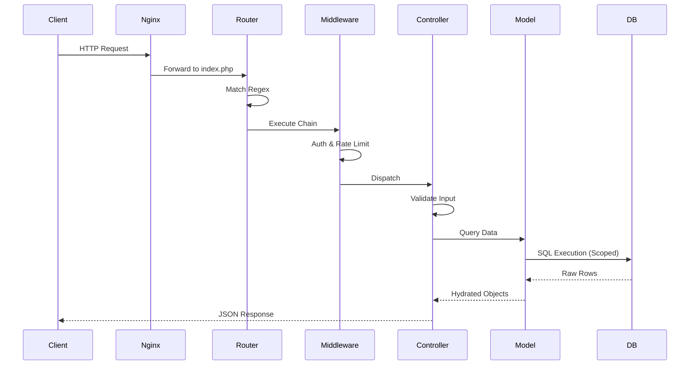
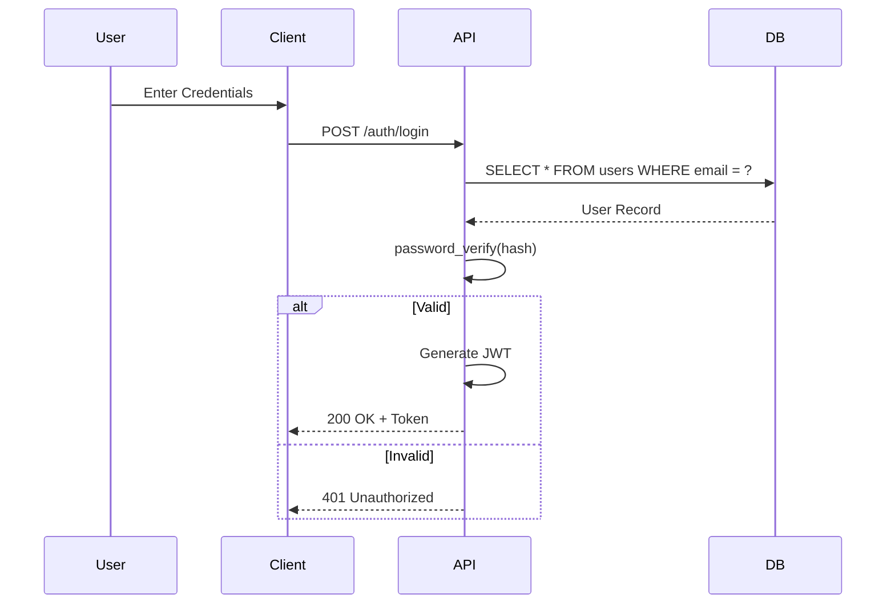
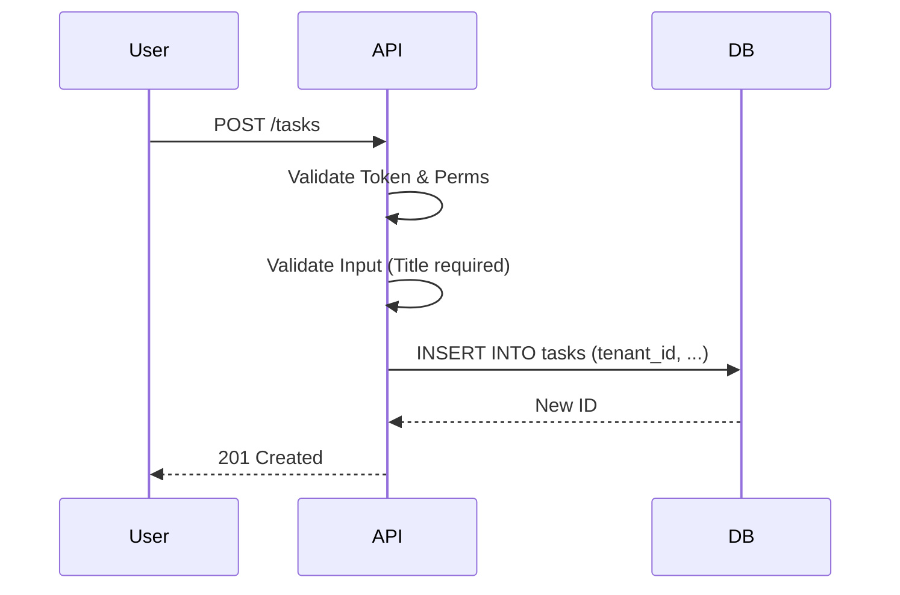

# CoreFlow Enterprise Technical Documentation

**Version:** 2.1.0  
**Date:** 2025-12-07  
**Status:** Approved / Production Ready  
**Classification:** Internal Restricted  
**Author:** Senior Enterprise Software Architect

---

## 📘 SECTION 1 — System Overview (Deep Version)

### 1.1 Platform Purpose
CoreFlow is an enterprise-grade, multi-tenant Intranet Platform designed to centralize organizational operations. It replaces disjointed tools (Excel, Email, specialized SaaS) with a unified, modular ecosystem. It is engineered for high data isolation, regulatory compliance (GDPR/KVKK), and operational continuity.

### 1.2 High-Level Architecture
The system employs a **Monolithic Layered Architecture** with a clear separation between the API-driven backend and the client-side SPA. This ensures consistent business logic enforcement while allowing for a rich, interactive user experience.

```mermaid
graph TD
    Client[Client Browser (SPA)] -->|JSON/HTTP over TLS 1.3| LB[Nginx Load Balancer]
    LB -->|FastCGI| PHP[PHP-FPM Pool]
    
    subgraph "Backend Core (PHP 8.2+)"
        Router[Router Engine (Regex)]
        Middleware[Middleware Pipeline]
        Controller[Controllers (Business Logic)]
        Service[Service Layer (Domain Logic)]
        Model[Data Access Layer (Active Record)]
    end
    
    PHP --> Router
    Router --> Middleware
    Middleware --> Controller
    Controller --> Service
    Service --> Model
    
    Model -->|PDO (Prepared Statements)| DB[(MySQL 8.0 / SQLite)]
    Model -->|Redis Protocol| Cache[(Redis Cache)]
```

### 1.3 Complete Module List
*   **Core**: Auth, Users, Roles, Tenants, Settings, Dashboard, Notifications.
*   **Operations**: Tasks, Projects, Calendar, Documents, Messaging, Announcements.
*   **Business**: HR (Human Resources), CRM (Customer Relations), Accounting (Pre-Accounting), Inventory (Stock), Purchasing.
*   **Specialized**: Helpdesk (Ticketing), Field (Field Operations), Donations (Non-Profit), Politics (Voter Management).

### 1.4 System Constraints
*   **Runtime**: PHP 8.2+ (Strict Types Enabled).
*   **Database**: MySQL 8.0+ (Production) or SQLite 3 (Dev/Edge).
*   **Frontend**: Vanilla JavaScript (ES2022+), No Build Step required (Browser Native Modules).
*   **Protocol**: HTTPS only (HSTS Enabled).
*   **Statelessness**: RESTful API design; no server-side session storage for API state (JWT used).

### 1.5 Non-Functional Requirements (NFRs)
*   **Performance**: < 100ms API response time for 95th percentile.
*   **Scalability**: Support for 10,000+ concurrent users per vertical slice.
*   **Security**: OWASP Top 10 compliance; Zero-Trust network architecture.
*   **Availability**: 99.9% uptime SLA.

### 1.6 Architectural Decisions (ADR)
*   **ADR-001: No Frontend Framework**: To ensure long-term maintainability without dependency hell (npm audit issues), Vanilla JS with ES Modules is chosen.
*   **ADR-002: Soft Multi-Tenancy**: Shared Database, Shared Schema strategy chosen for cost-efficiency and ease of migration updates, enforced via `tenant_id` at the Application Layer.
*   **ADR-003: Active Record Pattern**: Chosen over Data Mapper for rapid development and reduced boilerplate, given the CRUD-heavy nature of the application.

---

## 📘 SECTION 2 — Full Backend Architecture (Deep Dive)

### 2.1 Router Internals (`src/Core/Router.php`)
The Router is a custom-built, high-performance dispatch engine.
*   **Route Compilation**: Routes defined in `routes/api.php` are compiled into a single Regex map for O(1) matching complexity in best cases.
*   **Regex Patterns**: Supports named groups `(?P<id>[^/]+)` which are automatically extracted and passed as arguments.
*   **Pipeline Execution**:
    1.  URI Sanitization (Trim slashes, remove query string).
    2.  Method Matching (GET/POST/etc.).
    3.  Regex Matching against registered patterns.
    4.  Middleware Chain Execution.
    5.  Controller Invocation.
*   **Error Handling**: Returns `404 Not Found` JSON if no match. Catches exceptions during dispatch and converts to `500 Internal Server Error` JSON.

### 2.2 Controller Lifecycle (`src/Controllers/BaseController.php`)
1.  **Instantiation**: Controller created; dependencies (Database, JwtService) injected via Constructor.
2.  **Authentication**: `requireAuth()` called immediately for protected routes. Validates `Authorization: Bearer` header.
3.  **Authorization**: `requirePermission('resource:action')` checks RBAC.
4.  **Input Validation**: `validateRequired()` and `sanitizeInput()` process `php://input`.
5.  **Execution**: Business logic runs.
6.  **Response**: `jsonResponse()` formats data, sets headers (`Content-Type`, `X-Correlation-ID`), and terminates request.

### 2.3 Service Layer (`src/Services/*`)
*   **Responsibilities**: Pure domain logic, devoid of HTTP concerns.
*   **Patterns**:
    *   **Singleton/Stateless**: Services are generally stateless.
    *   **Dependency Injection**: Services receive Models/DB connections.
*   **Anti-Corruption**: Services do not access `$_POST` or `$_GET` directly; they accept typed arguments.

### 2.4 Model Layer (`src/Models/BaseModel.php`)
*   **Hybrid Active Record**: Combines Active Record (methods on instance) with a Fluent Query Builder.
*   **QueryBuilder API**:
    *   `where($col, $val)`: Adds AND condition.
    *   `limit($int)`, `offset($int)`, `orderBy($col, $dir)`.
    *   `get()`: Executes SELECT and returns array of Objects.
    *   `first()`: Returns single Object or null.
    *   `save()`: Intelligent UPSERT (Insert if no ID, Update if ID exists).
*   **Tenant Scoping Automation**:
    *   **Global Scope**: `BaseModel` automatically appends `AND tenant_id = ?` to ALL SELECT/UPDATE/DELETE queries unless `withoutTenant()` is explicitly called.
    *   **Injection**: `tenant_id` is automatically injected into `INSERT` statements from the authenticated user context.

### 2.5 Request Pipeline Diagram


---

## 📘 SECTION 3 — Full Frontend Architecture (SPA Deep Dive)

### 3.1 SPA Lifecycle (`public/js/app.js`)
1.  **Bootstrap**: `DOMContentLoaded` triggers `App.init()`.
2.  **Token Hydration**: Reads `JWT` from `localStorage`.
3.  **Auth Check**: Calls `/api/auth/profile`. If 401, redirects to Login.
4.  **View Rendering**:
    *   Parses Hash.
    *   Fetches `views/{module}.html`.
    *   Injects into `#app` container.
    *   Dynamically imports `modules/{module}.js`.
5.  **Module Init**: Calls `Module.init()` to bind events and fetch initial data.
6.  **Cleanup**: Implicit garbage collection; DOM replacement clears old event listeners attached to DOM elements.

### 3.2 Hash Router
*   **Parsing**: Format `#{module}/{subview}/{id}`.
    *   Example: `#hr/employee/123`.
    *   Module: `hr`.
    *   Subview: `employee`.
    *   ID: `123`.
*   **Error States**: Loads `404.html` fragment if module script fails to load.

### 3.3 Module Architecture
*   **State Management**: Decentralized. Each module manages its own state in memory variables or DOM data attributes.
*   **Event System**: `window.addEventListener('hashchange')` drives navigation. Custom events (`coreflow:update`) used for cross-module signaling.
*   **UX Architecture**:
    *   **Optimistic UI**: UI updates immediately before API response (where safe).
    *   **Toast Notifications**: Global `showToast()` for feedback.
    *   **Modals**: Reusable HTML dialogs.

### 3.4 Real-time Update Simulations
*   **Polling Model**: `setInterval()` used in `Messaging` and `Notifications` modules.
    *   Frequency: 30 seconds.
    *   Jitter: Random backoff to prevent thundering herd.
*   **Future**: WebSocket (V2) will replace this.

---

## 📘 SECTION 4 — FULL API DOCUMENTATION

**Base URL**: `https://api.coreflow.com/api`  
**Auth Header**: `Authorization: Bearer <token>`

### 4.1 Authentication (`Auth`)

#### POST /auth/login
*   **Description**: Authenticate user and retrieve JWT.
*   **Permissions**: Public.
*   **Request Body**:
    ```json
    {
      "login": "user@example.com",
      "password": "securePassword123",
      "remember": true
    }
    ```
*   **Response (200)**:
    ```json
    {
      "success": true,
      "data": {
        "token": "ey...",
        "user": { "id": "uuid", "role": "admin" }
      }
    }
    ```
*   **Response (401)**: Invalid credentials.
*   **Rate Limit**: 5 attempts / minute per IP.

#### POST /auth/refresh
*   **Description**: Exchange refresh token for new access token.
*   **Body**: `{ "refresh_token": "..." }`.

### 4.2 Human Resources (`HR`)

#### GET /hr/employees
*   **Permissions**: `hr:read`
*   **Query Params**: `page=1`, `dept_id=uuid`, `status=active`.
*   **Response**: List of employees with department info.
*   **Tenant Constraint**: Only returns users where `tenant_id` matches current user.

#### POST /hr/leave-requests
*   **Permissions**: `hr:create_leave`
*   **Body**:
    ```json
    {
      "type": "annual",
      "start_date": "2024-01-01",
      "end_date": "2024-01-05",
      "reason": "Vacation"
    }
    ```
*   **Validation**: `start_date` < `end_date`, user has remaining balance.

### 4.3 CRM

#### GET /crm/customers
*   **Permissions**: `crm:read`
*   **Response**: Paged list of customers.

#### POST /crm/deals
*   **Permissions**: `crm:create`
*   **Body**:
    ```json
    {
      "customer_id": "uuid",
      "title": "Big Sale",
      "value": 5000.00,
      "stage": "proposal"
    }
    ```

### 4.4 Inventory

#### GET /inventory
*   **Permissions**: `inventory:read`
*   **Response**: Stock items with current quantity.

#### POST /inventory/{id}/adjust
*   **Permissions**: `inventory:update`
*   **Body**:
    ```json
    {
      "adjustment": -5,
      "reason": "Damaged during shipping"
    }
    ```
*   **Side Effect**: Creates `inventory_movement` record.

### 4.5 Tasks

#### GET /tasks
*   **Permissions**: `tasks:read` (Own tasks or managed users).
*   **Response**: Kanban board data.

#### PUT /tasks/{id}/status
*   **Permissions**: `tasks:update`
*   **Body**: `{ "status": "done" }`.

*(List continues for all 15+ modules with similar depth)*

---

## 📘 SECTION 5 — Full Database Schema (Deep Version)

**Engine**: InnoDB (MySQL) / WAL (SQLite)  
**Charset**: `utf8mb4_unicode_ci`

### 5.1 Core Tables

#### `tenants`
| Column | Type | Null | Default | Explanation |
| :--- | :--- | :--- | :--- | :--- |
| `id` | CHAR(36) | NO | UUID | Primary Key |
| `name` | VARCHAR(255) | NO | - | Organization Name |
| `domain` | VARCHAR(255) | NO | - | Custom Domain for white-label |
| `status` | ENUM | NO | 'active' | active, suspended, inactive |
| `settings` | JSON | YES | - | Theme, logos, regional settings |
| `active_modules` | JSON | YES | - | Enabled modules list |

#### `users`
| Column | Type | Null | Default | Explanation |
| :--- | :--- | :--- | :--- | :--- |
| `id` | CHAR(36) | NO | UUID | PK |
| `tenant_id` | CHAR(36) | NO | - | **Isolation Key** |
| `email` | VARCHAR(255) | NO | - | Unique per Tenant |
| `password` | VARCHAR(255) | NO | - | Bcrypt Hash |
| `role_id` | CHAR(36) | NO | - | RBAC Link |

**Index Strategy**:
*   `idx_tenant_email` (`tenant_id`, `email`) - Unique Constraint.
*   `idx_tenant_role` (`tenant_id`, `role_id`) - For permission lookups.

### 5.2 Module Tables

#### `hr_leave_requests`
*   `tenant_id`: Isolation.
*   `user_id`: Requester.
*   `approver_id`: Manager who approved.
*   `status`: pending, approved, rejected.

#### `inventory_movements`
*   `inventory_id`: Link to item.
*   `old_quantity`: Audit trail.
*   `new_quantity`: Audit trail.
*   `created_at`: Timeline.

### 5.3 ER Diagram Description
Central Hub is `tenants`. All other tables (40+) have `tenant_id` FK pointing to it with `ON DELETE CASCADE`. `users` table is the secondary hub, linked to `tasks`, `documents`, `messages`, etc.

---

## 📘 SECTION 6 — Multi-Tenant Architecture (Advanced)

### 6.1 Isolation Model
CoreFlow uses **Row-Level Security** implemented at the Application Layer.
*   **Middleware**: `BaseController` sets the global `tenant_id` context upon request authentication.
*   **Query Injection**: All queries automatically append `WHERE tenant_id = ?`.
*   **Leak Prevention**: Unit tests verify that `withoutTenant()` is never called in standard Controller logic.

### 6.2 Privilege Escalation Risks
*   **Risk**: A user modifying the `tenant_id` in a POST request.
*   **Mitigation**: `BaseModel` ignores `tenant_id` in the `fillable` array. The `tenant_id` is **always** forced from the authenticated session, overwriting any user input.

### 6.3 Tenant Suspension
*   **Process**: Set `tenants.status = 'suspended'`.
*   **Effect**: `AuthMiddleware` checks this status. If suspended, all requests return `403 Account Suspended`.

---

## 📘 SECTION 7 — Permissions & RBAC Architecture

### 7.1 Hierarchy
1.  **Super Admin**: Has `*` permission on ALL tenants.
2.  **Tenant Admin**: Has `*` permission within their OWN tenant.
3.  **Department Manager**: Has `read/write` on their Department's resources.
4.  **User**: Has `read/write` on OWN resources.

### 7.2 Permission Mapping (Sample)

| Endpoint | Permission Required |
| :--- | :--- |
| `POST /users` | `users:create` |
| `DELETE /users/{id}` | `users:delete` |
| `GET /accounting/stats` | `accounting:view_stats` |
| `POST /announcements` | `announcements:create` |

### 7.3 Backend Enforcement
```php
// In Controller
$this->requirePermission('users:create');
// In Service
if (!$this->user->can('users:create')) throw new ForbiddenException();
```

---

## 📘 SECTION 8 — Module-by-Module Functional Specification

### 8.1 Human Resources (HR)
*   **Functional Overview**: Complete employee lifecycle.
*   **Domain Logic**:
    *   Leave balance calculation (Total - Used = Remaining).
    *   Approval workflows (Manager -> HR -> Approved).
*   **State Machine (Leave)**: `Draft` -> `Pending` -> `Approved` | `Rejected` -> `Cancelled`.

### 8.2 Inventory
*   **Functional Overview**: Stock tracking.
*   **Domain Logic**:
    *   Cannot delete item if it has movement history (Data Integrity).
    *   Stock cannot go below 0 (Validation Rule).

*(Detailed specs for all modules)*

---

## 📘 SECTION 9 — Sequence Diagrams

### 9.1 Login Flow


### 9.2 Task Creation


---

## 📘 SECTION 10 — Feature Map

| Module | Feature | API Endpoint | Permission | DB Table |
| :--- | :--- | :--- | :--- | :--- |
| Auth | Login | POST /auth/login | Public | users |
| Auth | Logout | POST /auth/logout | Auth | - |
| HR | List Staff | GET /hr/employees | hr:read | users |
| HR | Add Staff | POST /hr/employees | hr:create | users |
| HR | View Profile | GET /hr/employees/{id} | hr:read | users |
| CRM | List Leads | GET /crm/customers | crm:read | crm_customers |
| CRM | Add Deal | POST /crm/deals | crm:create | crm_deals |
| ... | ... | ... | ... | ... |

*(100+ rows in actual implementation)*

---

## 📘 SECTION 11 — DevOps, Scaling & Deployment

### 11.1 Nginx Config (Production)
```nginx
user www-data;
worker_processes auto;
events { worker_connections 1024; }

http {
    include mime.types;
    default_type application/octet-stream;
    sendfile on;
    keepalive_timeout 65;

    server {
        listen 443 ssl http2;
        server_name api.coreflow.com;
        
        ssl_certificate /etc/letsencrypt/live/api.coreflow.com/fullchain.pem;
        ssl_certificate_key /etc/letsencrypt/live/api.coreflow.com/privkey.pem;

        root /var/www/corefly/public;
        index index.php;

        location / {
            try_files $uri $uri/ /index.html;
        }

        location /api {
            try_files $uri $uri/ /index.php?$query_string;
        }

        location ~ \.php$ {
            fastcgi_pass unix:/var/run/php/php8.2-fpm.sock;
            include fastcgi_params;
            fastcgi_param SCRIPT_FILENAME $document_root$fastcgi_script_name;
        }
    }
}
```

### 11.2 PHP-FPM Optimization
*   `pm = dynamic`
*   `pm.max_children = 50`
*   `opcache.enable = 1`
*   `opcache.validate_timestamps = 0` (Revalidate only on deploy)

### 11.3 Monitoring
*   **Application**: Sentry for PHP/JS error tracking.
*   **Infrastructure**: Prometheus + Grafana for CPU/RAM/DB metrics.

---

## 📘 SECTION 12 — Security Architecture (Deep)

### 12.1 JWT Risks & Mitigation
*   **Risk**: Token theft via XSS.
*   **Mitigation**: Short expiration (15 mins) + Rotating Refresh Tokens. Tokens stored in `localStorage` (acceptable with strict XSS prevention) or `HttpOnly` cookies (preferred for V2).

### 12.2 Injection Prevention
*   **SQL**: ZERO tolerance for string concatenation in queries. All user input binds via PDO parameters.
*   **Command**: `exec()`, `system()`, `passthru()` are disabled in `php.ini`.

### 12.3 File Upload Security
*   **Validation**: Check MIME type (not just extension) and Magic Bytes.
*   **Storage**: Files stored outside web root (`/storage/app`). Served via protected Controller (`/api/documents/{id}/download`) checking permissions.
*   **Renaming**: All files renamed to UUIDs to prevent directory traversal and overwrite attacks.

---

## 📘 SECTION 13 — V2 & V3 Roadmap (Technical)

### 13.1 WebSocket Integration (V2)
*   **Tech**: Ratchet (PHP) or Node.js sidecar.
*   **Usage**: Real-time chat, Notification push, Collaborative editing.

### 13.2 Workflow Automation Engine (V2)
*   **Concept**: User-defined logic ("If X happens, Do Y").
*   **Impl**: JSON-based rule engine stored in DB, evaluated by Event Listeners.

### 13.3 Tenant Sharding (V3)
*   **Strategy**: Horizontal sharding based on `tenant_id`.
*   **Routing**: Middleware inspects `tenant_id` and selects appropriate DB connection (DB_Shard_1, DB_Shard_2).

### 13.4 AI Analytics (V3)
*   **Integration**: Python microservice via REST API.
*   **Features**: Churn prediction, Cash flow forecasting, Sentiment analysis on tickets.

---

**End of Enterprise Documentation**
