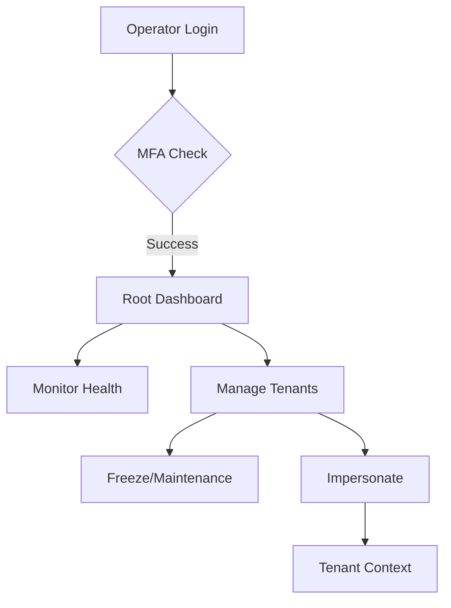

# CoreFlow Enterprise Architecture Blueprint
**Version:** 1.0.0
**Status:** FINAL / AUTHORITATIVE
**Scope:** Root Console & SaaS Operator Platform

---

## 1. SYSTEM OVERVIEW

### 1.1 Purpose
The **CoreFlow Root Console** is the centralized "Command & Control" center for the CoreFlow SaaS platform. Unlike tenant admin panels which are scoped to a single organization, the Root Console operates at the **Platform Level**. It allows Platform Operators (SREs, Support, Product Owners) to manage the entire lifecycle of tenants, users, billing, and infrastructure without database-level intervention.

### 1.2 Domain Model Summary
*   **Platform:** The aggregate of all infrastructure and code.
*   **Root Operator:** A privileged user with `super-admin-role` capable of crossing tenant boundaries.
*   **Tenant:** A logical isolation unit (Company/Organization) identified by `tenant_id`.
*   **Global User:** A user identity that exists independently of a tenant (though currently linked via `tenant_id` in the schema, the Root Console treats them as a global pool).
*   **Resource:** Any entity (Invoice, Log, Metric) belonging to a tenant or the system.

### 1.3 Multitenancy Architecture
*   **Strategy:** Shared Database, Shared Schema (Discriminator Column).
*   **Implementation:** All tables (except system configs) carry a `tenant_id` column.
*   **Isolation Enforcement:**
    *   **Tenant Layer:** `GlobalScope` automatically applies `WHERE tenant_id = ?`.
    *   **Root Layer:** Explicitly uses `withoutTenant()` global scopes to bypass isolation for management purposes.

### 1.4 Root-Level Access Flow
1.  **Authentication:** Standard Login via `/login`.
2.  **Authorization:** `RootAuthMiddleware` checks for `super-admin-role`.
3.  **Routing:** Requests directed to `/root/*` namespace.
4.  **Context:** The concept of "Current Tenant" is nullified or set to "System" context.

### 1.5 Security Model
*   **Zero-Trust for Tenants:** Tenants cannot see each other.
*   **Audited Access for Root:** Every action performed by a Root Operator on a Tenant is logged in the `audit_logs` with a distinct `source: ROOT_CONSOLE` tag.

---

## 2. ENTERPRISE FUNCTIONAL DOMAINS

### 2.1 Observability (Global Monitoring Plane)
**Goal:** Total visibility into system health and tenant behavior.

*   **Capabilities:**
    *   **Live Log Streaming:** Real-time tailing of system and application logs via WebSocket/Polling.
    *   **Global Metric Ingestion:** Aggregation of CPU, RAM, Disk, and Network I/O.
    *   **Tenant-Level Metrics:** Per-tenant resource consumption (Storage size, DB Row count).
    *   **API Analytics:** Request rates, Error rates (4xx/5xx), and Latency distribution (p95/p99).
*   **Backend Services:** `SystemMetricsService`, `LogStreamService`, `AnalyticsService`.
*   **Frontend Modules:** `LiveConsoleWidget`, `HealthGauges`, `TrafficChart`.
*   **Telemetry:** Custom middleware `CollectTelemetry` to record request start/end times and status codes.

### 2.2 Operational Control Plane
**Goal:** Direct intervention capabilities for support and emergency response.

*   **Capabilities:**
    *   **Tenant Freeze/Unfreeze:** Immediate blocking of all tenant users.
    *   **Maintenance Mode:** Display "Under Maintenance" page for specific tenants.
    *   **Cache Management:** Flush Redis/File cache for specific keys or tenants.
    *   **Impersonation:** "Login as User" flow for debugging.
    *   **Kill-Switch:** Global disable switch for specific modules (e.g., "Disable Billing System").
*   **APIs:** `POST /root/tenants/{id}/freeze`, `POST /root/system/kill-switch`.
*   **Logs:** Strict audit trailing for all state-changing operations.

### 2.3 Governance Plane
**Goal:** Controlled rollout and configuration management.

*   **Capabilities:**
    *   **Feature Flags:** Toggle functionality per tenant or globally.
    *   **Rollout Strategies:** Percentage-based (Canary) or Group-based (Beta Testers).
    *   **Announcements:** Push system notifications to tenant dashboards.
    *   **Changelog:** Public-facing version history management.
*   **Data Models:** `FeatureFlags`, `Announcements`, `TenantGroups`.

### 2.4 Billing & Finance Plane
**Goal:** Monetization and revenue assurance.

*   **Capabilities:**
    *   **Metering Engine:** Count API calls, Storage usage, Active users.
    *   **Plan Management:** Define limits (Quotas) for each tier.
    *   **Invoice Generation:** PDF generation and email delivery.
    *   **Revenue Forecasting:** MRR (Monthly Recurring Revenue) calculation.
*   **Background Jobs:** `CalculateDailyUsage`, `GenerateMonthlyInvoices`, `RetryFailedPayments`.

### 2.5 Identity & Access Plane
**Goal:** Centralized identity management.

*   **Capabilities:**
    *   **Global User Directory:** Searchable index of all users across all tenants.
    *   **Security Policy:** Enforce password complexity, MFA requirements globally.
    *   **Role Editor:** Define what permissions constitute a "Manager" vs "Editor".
    *   **Session Management:** Force logout for suspicious users.

---

## 3. ENTERPRISE UI BLUEPRINT

### 3.1 Root Dashboard (`#root/dashboard`)
*   **Layout:** 4-Column Grid (Metrics) + 2-Column Grid (Charts) + 2-Column Grid (Tables) + Bottom Terminal.
*   **Components:** `MetricGauge`, `TrafficLineChart`, `TenantDoughnutChart`, `LiveLogTerminal`.
*   **Data Flows:** Polls `/root/stats` every 30s, Polls `/root/log-stream` every 2s.

### 3.2 Tenant Directory (`#root/tenants`)
*   **Layout:** Full-width Data Table with Sidebar Filters.
*   **Components:** `AdvancedDataTable` (Sort/Filter/Pagination), `StatusBadge`, `ActionDropdown` (Freeze, Impersonate, Delete).
*   **Interactive:** Row hover reveals quick actions.

### 3.3 Tenant Detail (`#root/tenants/{id}`)
*   **Layout:** Tabbed View (Overview, Users, Usage, Settings, Logs).
*   **Components:**
    *   *Overview:* Tenant Health, Plan Info.
    *   *Usage:* Historical consumption charts.
    *   *Settings:* Force feature flags, Maintenance toggle.
*   **Capabilities:** Deep dive operational control.

### 3.4 Global Users (`#root/users`)
*   **Layout:** Search-heavy Table.
*   **Components:** `UserAvatar`, `TenantLink`, `RoleBadge`.
*   **Actions:** Reset Password, Ban User, View Session History.

### 3.5 Logs & Streams (`#root/logs`)
*   **Layout:** Filter Bar (Top) + Infinite Scroll Log List.
*   **Components:** `LogViewer` (Monospace, Syntax Highlighting), `DateRangePicker`, `LevelFilter`.
*   **Data Source:** ElasticSearch or Database Audit Table.

### 3.6 Billing & Revenue (`#root/billing`)
*   **Layout:** KPI Cards (MRR, Churn) + Invoice List.
*   **Components:** `RevenueTrendChart`, `InvoiceStatusBadge`.

### 3.7 System Settings (`#root/settings`)
*   **Layout:** Vertical Tabs (General, Security, SMTP, White Label).
*   **Components:** `ToggleSwitch`, `SecretInput`, `ImageUploader` (Logo).

---

## 4. BACKEND ARCHITECTURE

### 4.1 New Services
1.  **`SystemMetricsService`**: Abstraction for OS-level stats (Windows WMI / Linux Sys).
2.  **`LogStreamService`**: Efficient file tailing and parsing logic.
3.  **`TenantOpsService`**: Encapsulates logic for freezing, cleaning, and migrating tenants.
4.  **`BillingService`**: Interfaces with Stripe/Payment Provider and internal metering.
5.  **`FeatureFlagService`**: Evaluates flags based on context (Tenant, User, Environment).

### 4.2 Database Schema Extensions
*   `feature_flags`: `id`, `key`, `value`, `rules` (JSON), `is_global`.
*   `announcements`: `id`, `title`, `body`, `target_audience` (JSON), `published_at`.
*   `usage_records`: `id`, `tenant_id`, `metric_key`, `value`, `recorded_at`.
*   `system_settings`: `key` (PK), `value`, `type`.

### 4.3 API Contract Definitions (REST)
*   `GET /root/stats`: System health.
*   `GET /root/log-stream`: Log tail.
*   `POST /root/tenants/{id}/freeze`: Change status to suspended.
*   `POST /root/tenants/{id}/maintenance`: Toggle settings.
*   `GET /root/billing/invoices`: Global invoice list.

### 4.4 Job Queue Architecture
*   **`HighPriority`**: Tenant Provisioning, Password Resets, Emergency Stops.
*   **`Normal`**: Email Notifications, Webhooks.
*   **`LowPriority`**: Usage Aggregation, Log Archiving.

---

## 5. SECURITY BLUEPRINT

### 5.1 Isolation Strategy
*   **Root Isolation:** Root Controllers are physically separated in `src/Controllers/Root`.
*   **Middleware:** `RequireRootAuth` is applied to the entire `/api/root` group.
*   **Data Leak Prevention:** Root APIs strictly define response shapes (DTOs) to avoid leaking sensitive columns (e.g., password hashes) when querying `allGlobal()`.

### 5.2 Audit Logging
*   **Rule:** "If it changes state, it gets logged."
*   **Format:** `[TIMESTAMP] [ACTOR_ID] [ACTION] [TARGET_TENANT_ID] [PAYLOAD]`
*   **Storage:** Database `audit_logs` table + Backup to text file.

### 5.3 Hardening
*   **Rate Limiting:** Stricter limits on Login endpoints, relaxed limits on Root Dashboard data endpoints.
*   **Session Timeout:** Root sessions expire after 30 minutes of inactivity.
*   **IP Whitelisting:** (Optional) Restrict Root access to VPN/Office IPs.

---

## 6. DELIVERY PLAN (PHASED ROADMAP)

### Faz 1: Observability Core (COMPLETED)
*   **Deliverables:** Root Dashboard, Live Log Stream, System Health Metrics (CPU/RAM).
*   **APIs:** `/root/dashboard`, `/root/stats`, `/root/log-stream`.
*   **UI:** Dashboard with Charts and Terminal.

### Faz 2: Operational Controls (COMPLETED)
*   **Deliverables:** Tenant Freeze/Unfreeze, Maintenance Mode, Cache Flush.
*   **APIs:** Tenant Ops Endpoints.
*   **UI:** Enhanced Tenant Table with Action Buttons.

### Faz 3: Governance & Configuration
*   **Deliverables:** Feature Flags, System Settings Editor, Global Announcements.
*   **DB:** Create `feature_flags`, `announcements`.
*   **UI:** Settings Page, Feature Flag Manager.

### Faz 4: Billing Engine
*   **Deliverables:** Metering Middleware, Invoice Generation, Revenue Dashboard.
*   **DB:** `usage_records`.
*   **Jobs:** `AggregateUsage`.

### Faz 5: Advanced Analytics + AI
*   **Deliverables:** Predictive Churn Models, Anomaly Detection in Logs, AI Assistant for Support.
*   **UI:** "Ask AI" widget in Root Console.

---

## 7. MODULE MAP & DIAGRAMS

### 7.1 Operator Lifecycle


### 7.2 Architecture Layers
```
[ Frontend SPA (Vanilla JS / Tailwind) ]
       |
       v
[ API Gateway (Routes/Api.php) ]
       |
       v
[ Root Middleware (Security) ]
       |
       v
[ Root Controllers (Orchestration) ]
    |          |            |
    v          v            v
[Services] [Eloquent] [System Libs]
```

---
*End of Blueprint*
